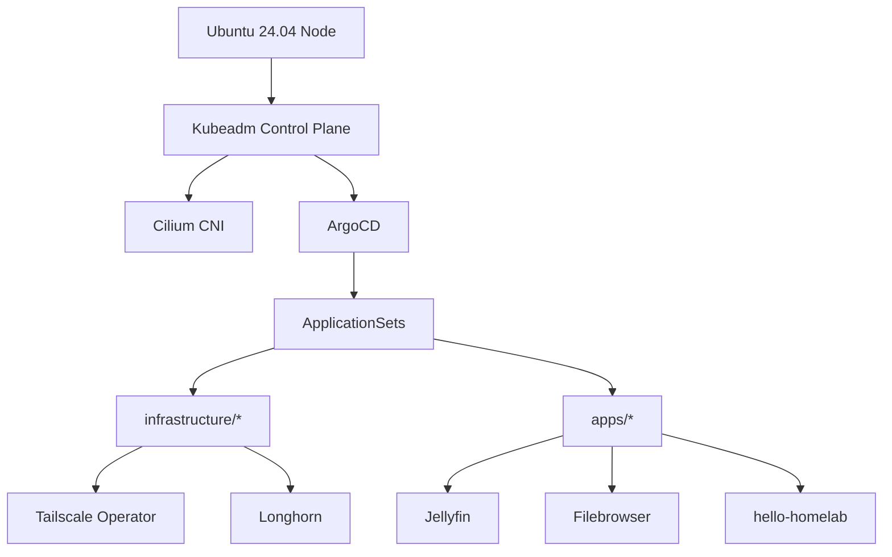
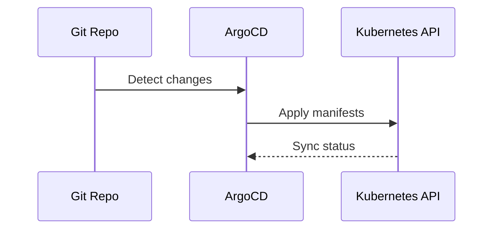

# Homelab

Single-node bare-metal Kubernetes cluster on Ubuntu 24.04 LTS, managed via GitOps with ArgoCD.

This repo is the source of truth for:
- Host provisioning (Ansible roles).
- Cluster bootstrap (kubeadm + Cilium + ArgoCD).
- Infrastructure and application manifests (ArgoCD ApplicationSets).

---

## Quick Map

- `ansible/`: host provisioning roles and playbooks.
- `bootstrap/`: ArgoCD bootstrap + ApplicationSets.
- `infrastructure/`: cluster-wide components.
- `apps/`: user workloads.
- `clusters/home/`: cluster-specific kubeadm config.

---

## Architecture





---

## Versions (Pinned)

- Kubernetes: `v1.34.3` in `ansible/group_vars/all.yaml` and `clusters/home/kubeadm-clusterconfiguration.yaml`.
- Cilium: `1.18.5` in this README and `ansible/group_vars/all.yaml`.
- Longhorn: `1.7.2` in `bootstrap/templates/longhorn.yaml`.
- Tailscale Operator: `1.78.3` in `infrastructure/tailscale/tailscale-operator.yaml`.
- Intel GPU plugin: `0.34.0` in `infrastructure/gpu/intel-plugin.yaml`.
- NVIDIA GPU plugin: `0.17.0` in `infrastructure/gpu/nvidia-plugin.yaml`.

---

## Phase 0: Prerequisites

```bash
sudo apt update
sudo add-apt-repository ppa:quentiumyt/nvtop
sudo apt install -y curl wget git pre-commit python3 python3-dev htop nvtop dmsetup npm nodejs
curl https://baltocdn.com/helm/signing.asc | gpg --dearmor | sudo tee /usr/share/keyrings/helm.gpg > /dev/null
echo "deb [arch=$(dpkg --print-architecture) signed-by=/usr/share/keyrings/helm.gpg] https://baltocdn.com/helm/stable/debian/ all main" | sudo tee /etc/apt/sources.list.d/helm-stable-debian.list
sudo apt-get update
sudo apt-get install -y helm
```

---

## Phase 0b: Optional Ansible Provisioning

> [!NOTE]
> The Ansible playbooks are the automated equivalent of Phases 1-3. If you use Ansible, skip straight to Phase 4.

### Configure Inventory and Variables

Update the node list and user in `ansible/inventory/hosts.yaml`, then confirm versions and paths in `ansible/group_vars/all.yaml`.

### Run the Playbook

```bash
cd ansible
ansible-playbook playbooks/site.yaml
```

---

## Phase 1: System Preparation

### Disable Swap (Permanently)

> [!IMPORTANT]
> Kubernetes requires swap to be disabled. If swap re-enables after reboot, kubelet will fail to start.

```bash
sudo swapoff -a
sudo sed -i '/\sswap\s/ s/^/#/' /etc/fstab
cat /etc/fstab | grep swap
free -h
```

### Load Kernel Modules

```bash
cat <<EOF | sudo tee /etc/modules-load.d/k8s.conf
overlay
br_netfilter
EOF

sudo modprobe overlay
sudo modprobe br_netfilter
```

### Configure Sysctl

```bash
cat <<EOF | sudo tee /etc/sysctl.d/k8s.conf
net.bridge.bridge-nf-call-iptables  = 1
net.bridge.bridge-nf-call-ip6tables = 1
net.ipv4.ip_forward                 = 1
EOF

sudo sysctl --system
```

### Increase Inotify Limits

> [!NOTE]
> Many containers (Jellyfin, Longhorn, etc.) require higher inotify limits. Without this, containers crash with "too many open files" errors.

```bash
sudo sysctl -w fs.inotify.max_user_instances=512
sudo sysctl -w fs.inotify.max_user_watches=524288
echo "fs.inotify.max_user_instances=512" | sudo tee /etc/sysctl.d/99-inotify.conf
echo "fs.inotify.max_user_watches=524288" | sudo tee -a /etc/sysctl.d/99-inotify.conf
```

---

## Phase 2: Install Containerd

```bash
sudo apt-get update
sudo apt-get install -y containerd
sudo mkdir -p /etc/containerd
containerd config default | sudo tee /etc/containerd/config.toml > /dev/null
sudo sed -i 's/SystemdCgroup = false/SystemdCgroup = true/g' /etc/containerd/config.toml
sudo systemctl restart containerd
sudo systemctl enable containerd
```

---

## Phase 3: Install Kubernetes

```bash
K8S_VERSION="v1.34.3"

sudo apt-get install -y apt-transport-https ca-certificates curl gpg
sudo mkdir -p -m 755 /etc/apt/keyrings
curl -fsSL https://pkgs.k8s.io/core:/stable:/$K8S_VERSION/deb/Release.key | \
  sudo gpg --dearmor -o /etc/apt/keyrings/kubernetes-apt-keyring.gpg

echo "deb [signed-by=/etc/apt/keyrings/kubernetes-apt-keyring.gpg] https://pkgs.k8s.io/core:/stable:/$K8S_VERSION/deb/ /" | \
  sudo tee /etc/apt/sources.list.d/kubernetes.list

sudo apt-get update
sudo apt-get install -y kubelet kubeadm kubectl
sudo apt-mark hold kubelet kubeadm kubectl
```

---

## Phase 4: Initialize Cluster

```bash
sudo kubeadm init --skip-phases=addon/kube-proxy
mkdir -p $HOME/.kube
sudo cp -i /etc/kubernetes/admin.conf $HOME/.kube/config
sudo chown $(id -u):$(id -g) $HOME/.kube/config
kubectl taint nodes --all node-role.kubernetes.io/control-plane-
```

> [!NOTE]
> During `kubeadm init`, kubeadm uploads the `ClusterConfiguration` to the `kubeadm-config` ConfigMap in `kube-system`. This repo captures that configuration in `clusters/home/kubeadm-clusterconfiguration.yaml`.

### Regenerate kubeadm cluster configuration

```bash
kubectl -n kube-system get configmap kubeadm-config -o jsonpath='{.data.ClusterConfiguration}' > clusters/home/kubeadm-clusterconfiguration.yaml
```

---

## Phase 5: Install Cilium

```bash
CILIUM_VERSION="1.18.5"
CILIUM_CLI_VERSION=$(curl -s https://raw.githubusercontent.com/cilium/cilium-cli/main/stable.txt)
curl -L --fail --remote-name-all \
  https://github.com/cilium/cilium-cli/releases/download/${CILIUM_CLI_VERSION}/cilium-linux-amd64.tar.gz{,.sha256sum}
sha256sum --check cilium-linux-amd64.tar.gz.sha256sum
sudo tar xzvfC cilium-linux-amd64.tar.gz /usr/local/bin
rm cilium-linux-amd64.tar.gz{,.sha256sum}
cilium install --version $CILIUM_VERSION --set kubeProxyReplacement=true
cilium hubble enable --ui
kubectl get nodes
cilium status
```

> [!NOTE]
> Keep `CILIUM_VERSION` aligned with `ansible/group_vars/all.yaml`.

---

## Phase 6: Install ArgoCD

```bash
kubectl create namespace argocd
kubectl apply -n argocd -f https://raw.githubusercontent.com/argoproj/argo-cd/stable/manifests/install.yaml
kubectl wait --for=condition=available --timeout=600s deployment/argocd-server -n argocd
kubectl -n argocd get secret argocd-initial-admin-secret -o jsonpath='{.data.password}' | base64 -d; echo
```

> [!NOTE]
> ArgoCD is exposed via Tailscale Ingress in `infrastructure/argocd-ingress/ingress.yaml` (hostname: `argocd`).

---

## Phase 7: Tailscale Setup

### Install Tailscale Client

```bash
curl -fsSL https://tailscale.com/install.sh | sh
sudo tailscale up
```

### Create OAuth Secret

Get OAuth credentials from https://login.tailscale.com/admin/settings/oauth (create with `devices:write` scope and tag `tag:k8s`).

```bash
kubectl create namespace tailscale
kubectl create secret generic operator-oauth \
  --namespace tailscale \
  --from-literal=client_id=YOUR_CLIENT_ID \
  --from-literal=client_secret=YOUR_CLIENT_SECRET
```

> [!IMPORTANT]
> Create the `operator-oauth` secret before Phase 10 so the Tailscale Operator deploys cleanly.

### Enable SSH for Remote Access

```bash
sudo apt-get install -y openssh-server
sudo systemctl enable --now ssh
```

### Remote kubectl Access

From another Tailnet device, SSH and run kubectl:

```bash
ssh user@<tailscale-hostname> kubectl get pods -A
```

Or copy kubeconfig to your other machine:

```bash
mkdir -p ~/.kube
scp user@<tailscale-hostname>:~/.kube/config ~/.kube/config
sed -i 's|server: https://.*:6443|server: https://<tailscale-hostname>:6443|' ~/.kube/config
kubectl get pods -A
```

---

## Phase 8: Storage Prerequisites (Longhorn)

### Install Required Packages

```bash
sudo apt-get update
sudo apt-get install -y open-iscsi nfs-common cryptsetup
sudo systemctl enable --now iscsid
```

### Create Storage Directory

> [!IMPORTANT]
> Longhorn needs a storage directory to exist. Create it on your preferred disk.

```bash
mkdir -p /home/your-username/longhorn-storage
```

> [!NOTE]
> Update the matching path in `bootstrap/templates/longhorn.yaml` and `ansible/group_vars/all.yaml`.

### Add Node Label for Longhorn Disk

> [!NOTE]
> With `createDefaultDiskLabeledNodes: true`, Longhorn only creates disks on nodes with this label.

```bash
kubectl label node $(hostname) node.longhorn.io/create-default-disk=true --overwrite
```

---

## Phase 9: GPU Support

### Intel GPU (iGPU for transcoding)

No host prerequisites needed - the Intel GPU Plugin DaemonSet handles everything.

The Intel GPU plugin manifest lives in `infrastructure/gpu/intel-plugin.yaml`.

Verify after deployment:

```bash
kubectl describe node | grep gpu.intel.com/i915
```

### NVIDIA GPU

#### Install NVIDIA Container Toolkit

```bash
curl -fsSL https://nvidia.github.io/libnvidia-container/gpgkey | \
  sudo gpg --dearmor -o /usr/share/keyrings/nvidia-container-toolkit-keyring.gpg --yes
curl -s -L https://nvidia.github.io/libnvidia-container/stable/deb/nvidia-container-toolkit.list | \
  sed 's#deb https://#deb [signed-by=/usr/share/keyrings/nvidia-container-toolkit-keyring.gpg] https://#g' | \
  sudo tee /etc/apt/sources.list.d/nvidia-container-toolkit.list
sudo apt-get update
sudo apt-get install -y nvidia-container-toolkit
```

#### Configure Containerd for NVIDIA

> [!IMPORTANT]
> These three commands are ALL required for NVIDIA to work in Kubernetes:

```bash
sudo nvidia-ctk runtime configure --runtime=containerd --set-as-default --cdi.enabled
sudo nvidia-ctk cdi generate --output=/etc/cdi/nvidia.yaml
sudo systemctl restart containerd
```

Verify after deployment:

```bash
kubectl describe node | grep nvidia.com/gpu
```

The NVIDIA GPU plugin manifest lives in `infrastructure/gpu/nvidia-plugin.yaml`.

---

## Phase 10: GitOps Activation

### Update Repository URLs

Edit these files and replace `YOUR_USERNAME` with your GitHub username:
- `bootstrap/root.yaml`
- `bootstrap/templates/infra-appset.yaml`
- `bootstrap/templates/apps-appset.yaml`

Confirm the Longhorn data path in `bootstrap/templates/longhorn.yaml` matches your host.

### Apply Bootstrap

```bash
kubectl apply -f bootstrap/root.yaml
```

### Apply Longhorn (special handling)

> [!NOTE]
> Longhorn is deployed as a separate ArgoCD Application because it uses Helm and needs to be in the `argocd` namespace.

```bash
kubectl apply -f bootstrap/longhorn.yaml
```

### Verify Deployment

```bash
kubectl get apps -n argocd
```

---

## Phase 11: Validate the Cluster

```bash
kubectl get nodes
kubectl get pods -A
```

---

## Adding Nodes to the Cluster

This section covers expanding the cluster with additional worker nodes or control plane nodes.

> [!NOTE]
> You can also add nodes by updating `ansible/inventory/hosts.yaml` and rerunning `ansible-playbook playbooks/site.yaml`.

### Prerequisites for New Nodes

Run these on each new node before joining:

```bash
sudo swapoff -a
sudo sed -i '/\sswap\s/ s/^/#/' /etc/fstab
cat <<EOF | sudo tee /etc/modules-load.d/k8s.conf
overlay
br_netfilter
EOF
sudo modprobe overlay
sudo modprobe br_netfilter
cat <<EOF | sudo tee /etc/sysctl.d/k8s.conf
net.bridge.bridge-nf-call-iptables  = 1
net.bridge.bridge-nf-call-ip6tables = 1
net.ipv4.ip_forward                 = 1
EOF
sudo sysctl --system
sudo sysctl -w fs.inotify.max_user_instances=512
sudo sysctl -w fs.inotify.max_user_watches=524288
echo "fs.inotify.max_user_instances=512" | sudo tee /etc/sysctl.d/99-inotify.conf
echo "fs.inotify.max_user_watches=524288" | sudo tee -a /etc/sysctl.d/99-inotify.conf
sudo apt-get update
sudo apt-get install -y containerd open-iscsi nfs-common cryptsetup
sudo mkdir -p /etc/containerd
containerd config default | sudo tee /etc/containerd/config.toml > /dev/null
sudo sed -i 's/SystemdCgroup = false/SystemdCgroup = true/g' /etc/containerd/config.toml
sudo systemctl restart containerd
sudo systemctl enable containerd
sudo systemctl enable --now iscsid
K8S_VERSION="v1.34.3"
sudo apt-get install -y apt-transport-https ca-certificates curl gpg
sudo mkdir -p -m 755 /etc/apt/keyrings
curl -fsSL https://pkgs.k8s.io/core:/stable:/$K8S_VERSION/deb/Release.key | sudo gpg --dearmor -o /etc/apt/keyrings/kubernetes-apt-keyring.gpg
echo "deb [signed-by=/etc/apt/keyrings/kubernetes-apt-keyring.gpg] https://pkgs.k8s.io/core:/stable:/$K8S_VERSION/deb/ /" | sudo tee /etc/apt/sources.list.d/kubernetes.list
sudo apt-get update
sudo apt-get install -y kubelet kubeadm kubectl
sudo apt-mark hold kubelet kubeadm kubectl
```

### For Nodes with NVIDIA GPU

```bash
curl -fsSL https://nvidia.github.io/libnvidia-container/gpgkey | \
  sudo gpg --dearmor -o /usr/share/keyrings/nvidia-container-toolkit-keyring.gpg --yes
curl -s -L https://nvidia.github.io/libnvidia-container/stable/deb/nvidia-container-toolkit.list | \
  sed 's#deb https://#deb [signed-by=/usr/share/keyrings/nvidia-container-toolkit-keyring.gpg] https://#g' | \
  sudo tee /etc/apt/sources.list.d/nvidia-container-toolkit.list
sudo apt-get update
sudo apt-get install -y nvidia-container-toolkit
sudo nvidia-ctk runtime configure --runtime=containerd --set-as-default --cdi.enabled
sudo nvidia-ctk cdi generate --output=/etc/cdi/nvidia.yaml
sudo systemctl restart containerd
```

### Generate Join Token (On Existing Control Plane)

Tokens expire after 24 hours. Run this on an existing control plane node to generate a new join command:

```bash
kubeadm token create --print-join-command
```

### Add a Worker Node

Run the join command from above on the new worker node:

```bash
sudo kubeadm join <control-plane-ip>:6443 --token <token> --discovery-token-ca-cert-hash sha256:<hash>
```

### Add a Control Plane Node (HA Setup)

> [!IMPORTANT]
> For HA control planes, you need a load balancer in front of all control planes and must initialize the first control plane with `--control-plane-endpoint=<load-balancer-ip>:6443`.

Generate a certificate key on an existing control plane:

```bash
sudo kubeadm init phase upload-certs --upload-certs
```

Then join with the `--control-plane` flag:

```bash
sudo kubeadm join <load-balancer-ip>:6443 \
  --token <token> \
  --discovery-token-ca-cert-hash sha256:<hash> \
  --control-plane \
  --certificate-key <certificate-key>
```

After joining, configure kubectl on the new control plane:

```bash
mkdir -p $HOME/.kube
sudo cp -i /etc/kubernetes/admin.conf $HOME/.kube/config
sudo chown $(id -u):$(id -g) $HOME/.kube/config
```

---

## Reproducibility Checklist

This repo aims to model the full host and cluster state. The following must be represented here:

- Host OS packages, sysctl, kernel modules, and container runtime: `ansible/` roles.
- Kubeadm cluster settings: `clusters/home/kubeadm-clusterconfiguration.yaml`.
- CNI and kube-proxy replacement: Cilium install steps in this README.
- Infrastructure components: `infrastructure/`.
- Applications and PVCs: `apps/`.
- Storage path and labels: `bootstrap/templates/longhorn.yaml` and Phase 8.
- Tailscale OAuth secret: created in Phase 7 (not stored in Git).

Items intentionally not stored in Git:
- Secrets and credentials.
- Data backups (out of scope for now).

---

## Recreate From Scratch (Ubuntu 24.04)

Use this section when rebuilding a node from bare metal or VM images:

1. Install Ubuntu 24.04 LTS and log in as a user with sudo.
2. Clone this repo and review `README.md` for versions and paths.
3. Choose one path:
   - Automated: run Phase 0b (Ansible provisioning), then continue at Phase 4.
   - Manual: run Phases 0-11 in order.
4. Apply GitOps bootstrap (Phase 10) and verify (Phase 11).

If you are rebuilding with existing data disks for Longhorn, ensure the storage path in Phase 8 points to the correct mount before applying `bootstrap/templates/longhorn.yaml`.

---

## Testing

Before pushing changes:

```bash
pre-commit run --all-files
kubectl get nodes
kubectl get pods -A
```
