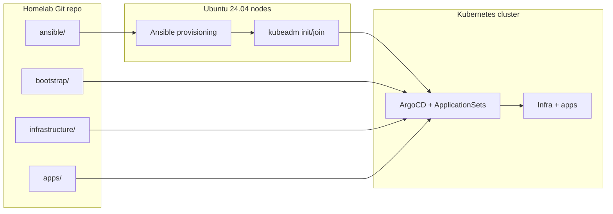
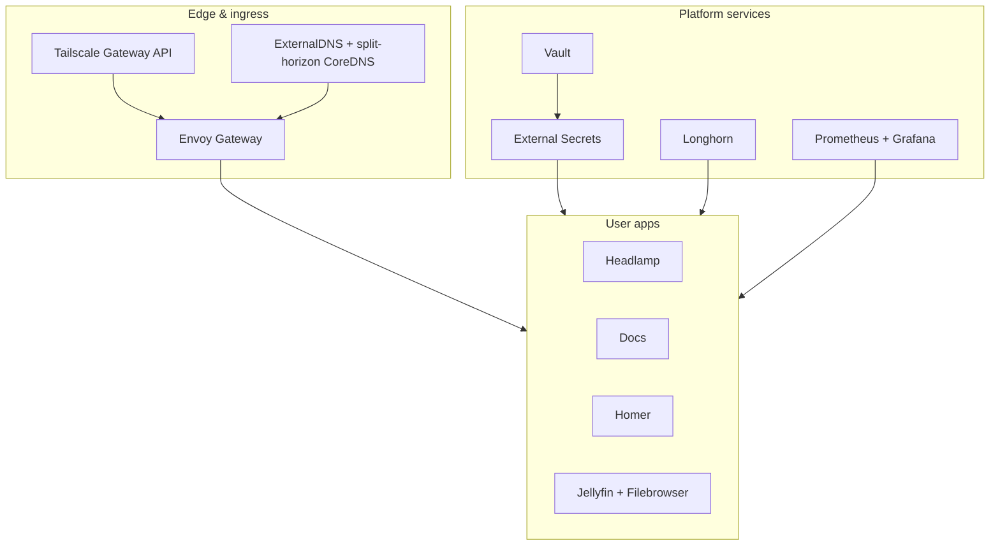
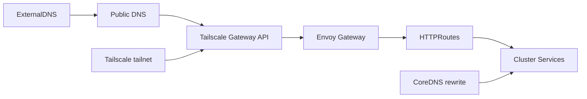
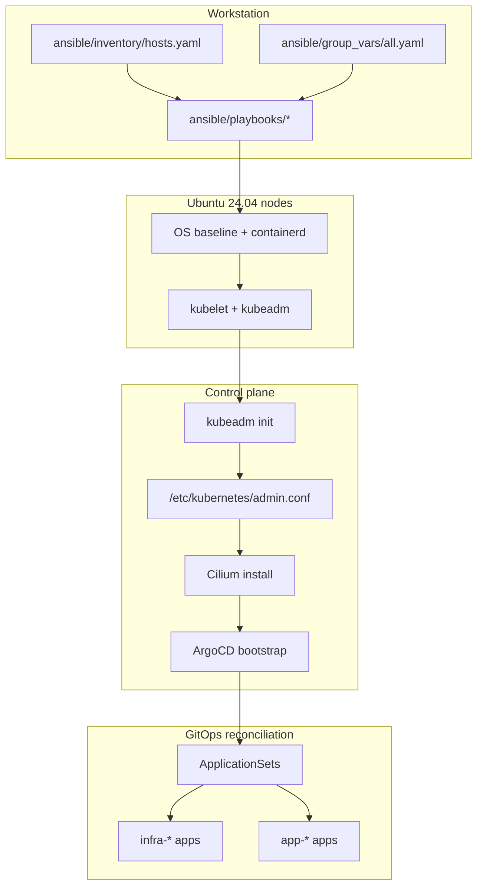
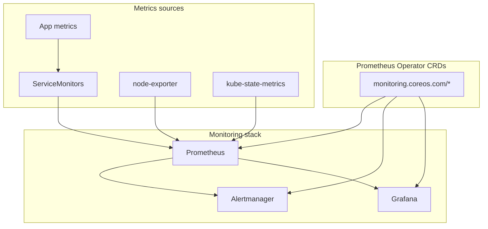

# Homelab

A self-hosted bare-metal Kubernetes cluster on Ubuntu 24.04 LTS.

- Uses Ansible for automated node provisioning with ArgoCD for GitOps-based cluster management
- Traffic flows through Tailscale for secure ingress and Envoy Gateway for routing, with Vault and External Secrets handling credentials
- Longhorn provides distributed storage with basic backup capabilities
- A local rehearsal workflow using Multipass VMs allows validating changes before deploying to hardware
- Additional cloud providers can follow the same pattern but are not documented yet

## Table of contents

- [Features](#features)
- [Architecture](#architecture)
  - [Core systems map](#core-systems-map)
  - [Platform services map](#platform-services-map)
  - [Network topology](#network-topology)
- [Quick start](#quick-start)
  - [Bare metal bring-up](#bare-metal-bring-up)
  - [From scratch flow](#from-scratch-flow)
  - [Local rehearsal](#local-rehearsal)
- [Documentation](#documentation)
- [Repository layout](#repository-layout)
- [Applications](#applications)
- [GitOps model](#gitops-model)
- [Operations](#operations)
- [Conventions](#conventions)
- [Monitoring topology](#monitoring-topology)
- [Maintainers](#maintainers)

## Features

- Multi-node bare-metal Kubernetes with kubeadm and Cilium
- GitOps-managed infrastructure and apps via ArgoCD ApplicationSets
- Tailscale Gateway API ingress with split-horizon DNS
- Vault + External Secrets for centralized secret management
- Longhorn storage, Prometheus monitoring, and optional GPU plugins
- Automated image updates with ArgoCD Image Updater
- Metrics Server for resource usage in Headlamp
- ExternalDNS automation for Gateway API routes
- Envoy Gateway data plane for Gateway API
- Kubescape operator for cluster security scanning

## Architecture

### Core systems map



### Platform services map



### Network topology



## Quick start

Bare metal is the primary target. The local VM flow exists to rehearse changes before touching hardware.

### Bare metal bring-up

Provision nodes, bootstrap Kubernetes, then hand off to ArgoCD.

```bash
nano ansible/inventory/hosts.yaml
ansible-playbook -i ansible/inventory/hosts.yaml ansible/playbooks/provision-cpu.yaml

sudo kubeadm init --pod-network-cidr=10.244.0.0/16
mkdir -p $HOME/.kube
sudo cp -i /etc/kubernetes/admin.conf $HOME/.kube/config
sudo chown $(id -u):$(id -g) $HOME/.kube/config
kubectl taint nodes --all node-role.kubernetes.io/control-plane-

CILIUM_VERSION=$(grep -E "cilium_version:" ansible/group_vars/all.yaml | head -n 1 | awk -F'"' '{print $2}')
cilium install --version "$CILIUM_VERSION" --values infrastructure/cilium/values.cilium

kubectl apply -k bootstrap/argocd
kubectl wait --for=condition=available --timeout=600s deployment/argocd-server -n argocd
kubectl apply -f bootstrap/root.yaml
```

Guided flow: <https://docs.sudhanva.me/how-to/from-scratch> and <https://docs.sudhanva.me/tutorials>

### From scratch flow



### Local rehearsal

Use Multipass to validate the full flow on your workstation.

```bash
./scripts/local-cluster.sh up
```

Low-resource rehearsal:

```bash
WORKER_COUNT=0 VM_CPUS=2 VM_MEMORY=3G VM_DISK=12G CILIUM_HUBBLE_ENABLED=false ./scripts/local-cluster.sh up
```

Tear down:

```bash
./scripts/local-cluster.sh down
```

## Documentation

Docs site: <https://docs.sudhanva.me>

Build locally:

```bash
cd docs
bun install
bun dev
```

Recommended reading paths:

- Start from scratch: <https://docs.sudhanva.me/how-to/from-scratch>
- Add a worker node: <https://docs.sudhanva.me/how-to/add-worker-node>
- Prereqs and system prep: <https://docs.sudhanva.me/tutorials/prerequisites>
- GitOps model: <https://docs.sudhanva.me/explanation/automation-model>
- Infra catalog: <https://docs.sudhanva.me/reference/infrastructure-components>
- App catalog: <https://docs.sudhanva.me/reference/applications>

## Repository layout

```bash
ansible/          Node provisioning
bootstrap/        ArgoCD bootstrap and ApplicationSets
infrastructure/   Cluster components managed by ArgoCD
apps/             User workloads managed by ArgoCD
clusters/         Cluster-specific overrides
scripts/          Automation helpers
docs/             Astro Starlight documentation
```

## Applications

| App | Purpose | Hostname |
| --- | --- | --- |
| Docs | Documentation site for cluster guides | `docs.sudhanva.me` |
| Headlamp | Kubernetes UI with OIDC support and metrics integration | `headlamp.sudhanva.me` |
| Homer | Home dashboard with service shortcuts | `home.sudhanva.me` |
| Jellyfin | Media streaming with GPU acceleration when available | `jellyfin.sudhanva.me` |
| Filebrowser | File manager for the media volume | `filebrowser.sudhanva.me` |
| ArgoCD | GitOps control plane UI | `argocd.sudhanva.me` |
| Longhorn | Storage UI | `longhorn.sudhanva.me` |
| Vault | Secrets UI | `vault.sudhanva.me` |
| Hubble UI | Cilium network visibility | `hubble.sudhanva.me` |
| Grafana | Metrics dashboards | `grafana.sudhanva.me` |
| Prometheus | Metrics queries | `prometheus.sudhanva.me` |
| Alertmanager | Alerting UI | `alertmanager.sudhanva.me` |

## GitOps model

ArgoCD reconciles everything under `infrastructure/` and `apps/` using ApplicationSets. Manual `kubectl apply` is discouraged after bootstrap.

Adding apps:

- Create `apps/<app>/app.yaml` to define the ArgoCD app name/path/namespace
- Add Kubernetes manifests in the same folder
- Add `kustomization.yaml` if you want Image Updater to write overrides

Image updates:

- ArgoCD Image Updater writes `.argocd-source-<app>.yaml` files into app folders
- These files are not Kubernetes resources and are ignored by kubeconform

## Operations

Routine checks:

```bash
kubectl get nodes
kubectl get pods -A
kubectl get apps -n argocd
```

Before pushing:

```bash
pre-commit run --all-files
```

## Conventions

- ApplicationSets generate `infra-*` and `app-*` ArgoCD applications from folders
- App folders use `app.yaml` for app metadata and manifests in the same directory
- `kustomization.yaml` enables Image Updater overrides per app
- Image updates write `.argocd-source-<app>.yaml` files into app folders

## Monitoring topology



## Maintainers

- [Sudhanva Narayana](https://sudhanva.me)
- [Maanasa Narayan](https://maanasanarayan.github.io)
