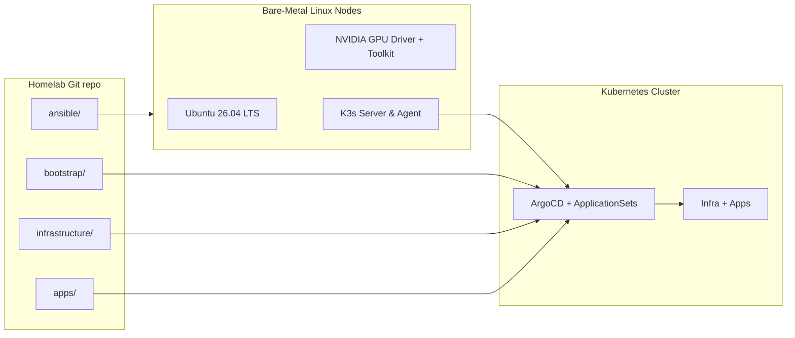
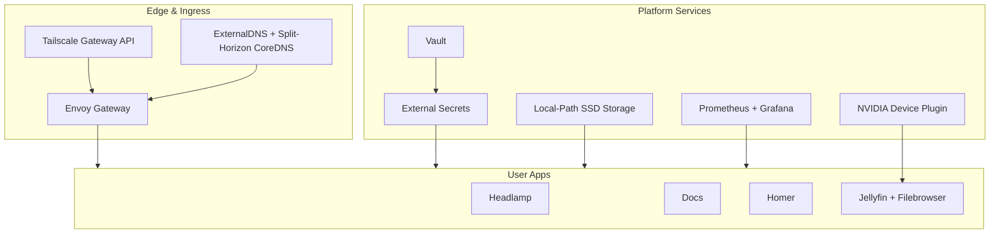
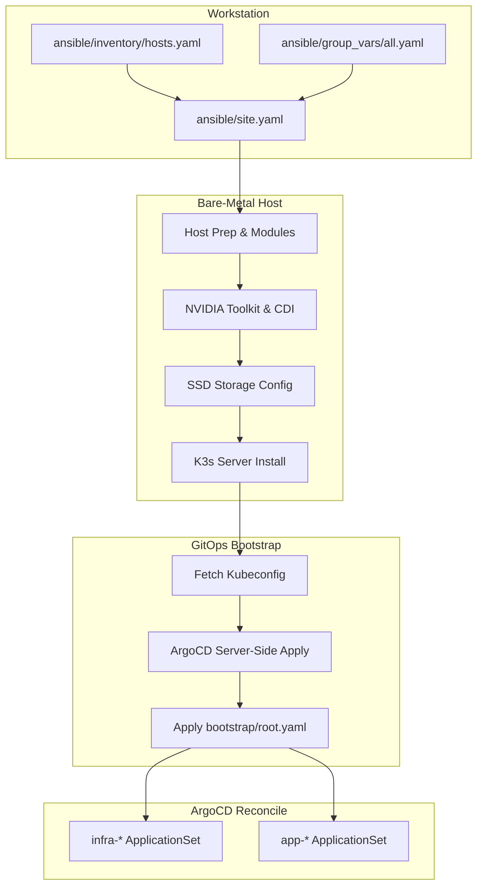

# Homelab

A self-hosted bare-metal Kubernetes cluster on Ubuntu 26.04 LTS powered by K3s and managed 100% via GitOps with ArgoCD.

- Provisioned from scratch using automated Ansible playbooks for zero-touch bare-metal bring-up
- Traffic flows through Tailscale for secure ingress and Envoy Gateway for routing, with Vault and External Secrets handling credentials
- High-performance local NVMe/SSD storage backed by K3s Local-Path Provisioner on dedicated solid-state drives
- Full hardware GPU acceleration with NVIDIA GTX 1050 Ti passed through to Kubernetes workloads via NVIDIA Container Toolkit and K8s Device Plugin
- Immutable GitOps operations where ArgoCD reconciles all infrastructure and user applications from this repository

## Table of contents

- [Features](#features)
- [Architecture](#architecture)
  - [Core systems map](#core-systems-map)
  - [Platform services map](#platform-services-map)
  - [Network topology](#network-topology)
- [Quick start](#quick-start)
  - [Automated bare metal bring-up](#automated-bare-metal-bring-up)
  - [From scratch flow](#from-scratch-flow)
- [Documentation](#documentation)
- [Repository layout](#repository-layout)
- [Applications](#applications)
- [GitOps model](#gitops-model)
- [Operations](#operations)
- [Maintainers](#maintainers)

## Features

- Single-node / multi-node bare-metal K3s Kubernetes with Flannel CNI
- Automated Ansible playbooks for host preparation, runtime configuration, and cluster bootstrap
- Full NVIDIA GPU hardware acceleration for AI and media transcoding
- GitOps-managed infrastructure and apps via ArgoCD ApplicationSets
- Tailscale Gateway API ingress with split-horizon DNS
- Vault + External Secrets Operator for centralized secret management
- Native high-speed SSD storage via Local-Path Provisioner
- Prometheus monitoring stack with Alertmanager and Grafana
- Automated container image updates with ArgoCD Image Updater
- Envoy Gateway data plane for Kubernetes Gateway API
- Kubescape operator for automated cluster security scanning

## Architecture

### Core systems map


```mermaid
flowchart LR
  subgraph Repo["Homelab Git repo"]
    Ansible["ansible/"]
    Bootstrap["bootstrap/"]
    Infra["infrastructure/"]
    Apps["apps/"]
  end

  subgraph Host["Bare-Metal Linux Nodes"]
    OS["Ubuntu 26.04 LTS"]
    GPU["NVIDIA GPU Driver + Toolkit"]
    K3s["K3s Server & Agent"]
  end

  subgraph Cluster["Kubernetes Cluster"]
    Argo["ArgoCD + ApplicationSets"]
    Workloads["Infra + Apps"]
  end

  Ansible --> Host
  Host --> K3s
  K3s --> Argo
  Bootstrap --> Argo
  Infra --> Argo
  Apps --> Argo
  Argo --> Workloads
```

### Platform services map


```mermaid
flowchart TB
  subgraph Edge["Edge & Ingress"]
    Tailscale["Tailscale Gateway API"]
    Envoy["Envoy Gateway"]
    DNS["ExternalDNS + Split-Horizon CoreDNS"]
  end

  subgraph Platform["Platform Services"]
    Vault["Vault"]
    ESO["External Secrets"]
    Storage["Local-Path SSD Storage"]
    Metrics["Prometheus + Grafana"]
    NVIDIA["NVIDIA Device Plugin"]
  end

  subgraph Apps["User Apps"]
    Headlamp["Headlamp"]
    Docs["Docs"]
    Homer["Homer"]
    Media["Jellyfin + Filebrowser"]
  end

  Tailscale --> Envoy
  DNS --> Envoy
  Envoy --> Apps
  Vault --> ESO
  ESO --> Apps
  Storage --> Apps
  Metrics --> Apps
  NVIDIA --> Media
```

### Network topology


```mermaid
flowchart LR
  Public["Public DNS"]
  Tailnet["Tailscale Tailnet"]
  ExternalDNS["ExternalDNS"]
  Gateway["Tailscale Gateway API"]
  Envoy["Envoy Gateway"]
  Routes["HTTPRoutes"]
  Services["Cluster Services"]
  CoreDNS["CoreDNS Rewrite"]

  ExternalDNS --> Public
  Public --> Gateway
  Tailnet --> Gateway
  Gateway --> Envoy
  Envoy --> Routes
  Routes --> Services
  CoreDNS --> Services
```

## Quick start

### Automated bare metal bring-up

Ensure your target machine is running Ubuntu with SSH and sudo access configured, then run one command from your workstation:

```bash
./scripts/provision.sh
```

To interact with the newly provisioned cluster:

```bash
export KUBECONFIG=$PWD/k3s.kubeconfig
kubectl get nodes -o wide
kubectl get pods -A
kubectl get apps -n argocd
```

### From scratch flow


```mermaid
flowchart TB
  subgraph Workstation["Workstation"]
    Inventory["ansible/inventory/hosts.yaml"]
    Vars["ansible/group_vars/all.yaml"]
    Playbook["ansible/site.yaml"]
  end

  subgraph Target["Bare-Metal Host"]
    Prep["Host Prep & Modules"]
    NvidiaSetup["NVIDIA Toolkit & CDI"]
    K3sInstall["K3s Server Install"]
    SSD["SSD Storage Config"]
  end

  subgraph Bootstrap["GitOps Bootstrap"]
    Kubeconfig["Fetch Kubeconfig"]
    ArgoApply["ArgoCD Server-Side Apply"]
    RootApp["Apply bootstrap/root.yaml"]
  end

  subgraph Sync["ArgoCD Reconcile"]
    Infra["infra-* ApplicationSet"]
    Apps["app-* ApplicationSet"]
  end

  Inventory --> Playbook
  Vars --> Playbook
  Playbook --> Prep
  Prep --> NvidiaSetup
  NvidiaSetup --> SSD
  SSD --> K3sInstall
  K3sInstall --> Kubeconfig
  Kubeconfig --> ArgoApply
  ArgoApply --> RootApp
  RootApp --> Infra
  RootApp --> Apps
```

## Documentation

Documentation is maintained under `docs/` using Astro Starlight.

Build documentation locally:

```bash
cd docs
bun install
bun dev
```

Key reference guides:

- From scratch installation: [Build K3s Cluster from Scratch](docs/src/content/docs/how-to/from-scratch.md)
- Secrets management: [HashiCorp Vault Secrets Management](docs/src/content/docs/how-to/vault.md)
- Version matrix: [Component Version Matrix](docs/src/content/docs/reference/versions.md)

## Repository layout

```bash
ansible/          Ansible playbooks, roles, and inventory for bare-metal setup
bootstrap/        ArgoCD bootstrap and ApplicationSet definitions
infrastructure/   Platform components managed by ArgoCD
apps/             User workloads managed by ArgoCD
scripts/          Automation and verification scripts
docs/             Astro Starlight documentation
```

## Applications

| App | Purpose | Hostname |
| --- | --- | --- |
| Docs | Documentation site for cluster guides | `docs.sudhanva.me` |
| Headlamp | Kubernetes UI with OIDC support and metrics integration | `headlamp.sudhanva.me` |
| Homer | Home dashboard with service shortcuts | `home.sudhanva.me` |
| Jellyfin | Media streaming with NVIDIA GPU acceleration | `jellyfin.sudhanva.me` |
| Filebrowser | File manager for persistent media volumes | `filebrowser.sudhanva.me` |
| ArgoCD | GitOps control plane UI | `argocd.sudhanva.me` |
| Vault | Centralized secrets management | `vault.sudhanva.me` |
| Grafana | Metrics dashboards | `grafana.sudhanva.me` |
| Prometheus | Metrics collector and query engine | `prometheus.sudhanva.me` |
| Alertmanager | Alert routing and notifications | `alertmanager.sudhanva.me` |

## GitOps model

ArgoCD reconciles everything under `infrastructure/` and `apps/` using ApplicationSets. Manual `kubectl apply` is discouraged after initial bootstrap.

Adding apps:

- Step 1: Create `apps/<app>/app.yaml` to define the ArgoCD app name, path, and namespace
- Step 2: Add Kubernetes manifests in the same folder
- Step 3: Add `kustomization.yaml` if you want Image Updater to write overrides

## Operations

Routine cluster health checks:

```bash
export KUBECONFIG=$PWD/k3s.kubeconfig
kubectl get nodes -o wide
kubectl get pods -A
kubectl get apps -n argocd
```

Before pushing code changes:

```bash
pre-commit run --all-files
```

## Maintainers

- [Sudhanva Narayana](https://sudhanva.me)
- [Maanasa Narayan](https://maanasanarayan.github.io)
