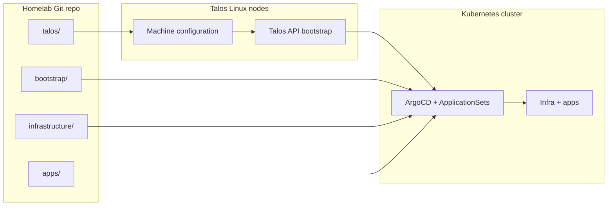
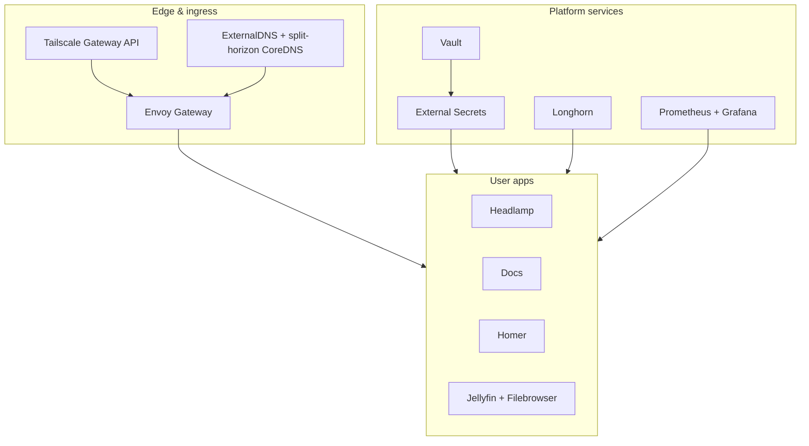
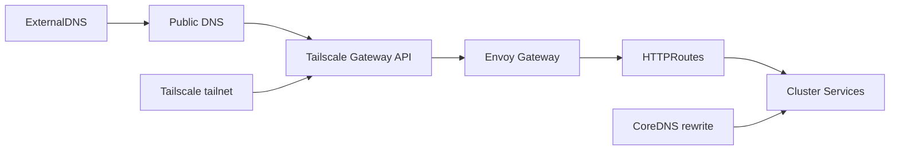
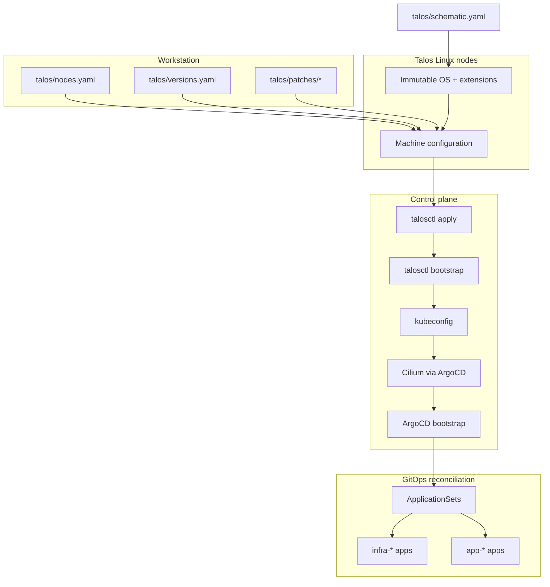
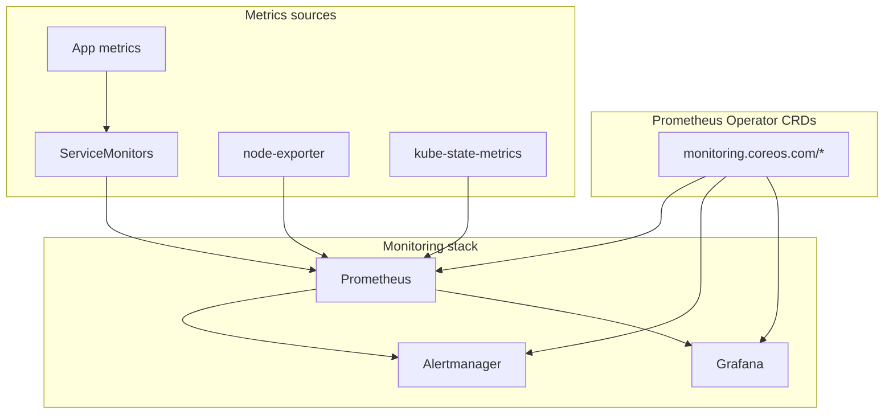

# Homelab

A self-hosted Talos Linux Kubernetes cluster on immutable infrastructure.

- Uses declarative Talos machine configuration for zero-touch node provisioning with ArgoCD for GitOps-based cluster management
- Traffic flows through Tailscale for secure ingress and Envoy Gateway for routing, with Vault and External Secrets handling credentials
- Longhorn provides distributed storage with basic backup capabilities
- A local rehearsal workflow using Talos QEMU clusters validates changes before deploying to hardware
- An Ubuntu 26.04 Apple Container workstation gives a Linux-native shell on any host
- Additional cloud providers can follow the same pattern but are not documented yet

## Table of contents

- [Features](#features)
- [Architecture](#architecture)
  - [Core systems map](#core-systems-map)
  - [Platform services map](#platform-services-map)
  - [Network topology](#network-topology)
- [Quick start](#quick-start)
  - [Bare metal bring-up](#bare-metal-bring-up)
  - [From scratch flow](#from-scratch-flow)
  - [Local rehearsal](#local-rehearsal)
- [Documentation](#documentation)
- [Repository layout](#repository-layout)
- [Applications](#applications)
- [GitOps model](#gitops-model)
- [Operations](#operations)
- [Conventions](#conventions)
- [Monitoring topology](#monitoring-topology)
- [Maintainers](#maintainers)

## Features

- Multi-node Talos Linux Kubernetes with immutable OS and Cilium
- GitOps-managed infrastructure and apps via ArgoCD ApplicationSets
- Tailscale Gateway API ingress with split-horizon DNS
- Vault + External Secrets for centralized secret management
- Longhorn storage, Prometheus monitoring, and optional GPU plugins
- Automated image updates with ArgoCD Image Updater
- Metrics Server for resource usage in Headlamp
- ExternalDNS automation for Gateway API routes
- Envoy Gateway data plane for Gateway API
- Kubescape operator for cluster security scanning

## Architecture

### Core systems map


```mermaid
flowchart LR
  subgraph Repo["Homelab Git repo"]
    Talos["talos/"]
    Bootstrap["bootstrap/"]
    Infra["infrastructure/"]
    Apps["apps/"]
  end

  subgraph Nodes["Talos Linux nodes"]
    Config["Machine configuration"]
    API["Talos API bootstrap"]
  end

  subgraph Cluster["Kubernetes cluster"]
    Argo["ArgoCD + ApplicationSets"]
    Workloads["Infra + apps"]
  end

  Talos --> Config
  Config --> API
  API --> Argo
  Bootstrap --> Argo
  Infra --> Argo
  Apps --> Argo
  Argo --> Workloads
```

### Platform services map


```mermaid
flowchart TB
  subgraph Edge["Edge & ingress"]
    Tailscale["Tailscale Gateway API"]
    Envoy["Envoy Gateway"]
    DNS["ExternalDNS + split-horizon CoreDNS"]
  end

  subgraph Platform["Platform services"]
    Vault["Vault"]
    ESO["External Secrets"]
    Longhorn["Longhorn"]
    Metrics["Prometheus + Grafana"]
  end

  subgraph Apps["User apps"]
    Headlamp["Headlamp"]
    Docs["Docs"]
    Homer["Homer"]
    Media["Jellyfin + Filebrowser"]
  end

  Tailscale --> Envoy
  DNS --> Envoy
  Envoy --> Apps
  Vault --> ESO
  ESO --> Apps
  Longhorn --> Apps
  Metrics --> Apps
```

### Network topology


```mermaid
flowchart LR
  Public["Public DNS"]
  Tailnet["Tailscale tailnet"]
  ExternalDNS["ExternalDNS"]
  Gateway["Tailscale Gateway API"]
  Envoy["Envoy Gateway"]
  Routes["HTTPRoutes"]
  Services["Cluster Services"]
  CoreDNS["CoreDNS rewrite"]

  ExternalDNS --> Public
  Public --> Gateway
  Tailnet --> Gateway
  Gateway --> Envoy
  Envoy --> Routes
  Routes --> Services
  CoreDNS --> Services
```

## Quick start

Bare metal is the primary target. The local VM flow exists to rehearse changes before touching hardware.

### Bare metal bring-up

Flash the installer, then run one scripted flow that hands off to ArgoCD.

```bash
./scripts/talos-baremetal.sh iso-url
./scripts/talos-baremetal.sh up
export KUBECONFIG=$PWD/talos/_out/kubeconfig
kubectl get nodes
kubectl get pods -A
```

Guided flow: <https://docs.sudhanva.me/how-to/from-scratch> and <https://docs.sudhanva.me/tutorials>

### From scratch flow


```mermaid
flowchart TB
  subgraph Workstation["Workstation"]
    Inventory["talos/nodes.yaml"]
    Vars["talos/versions.yaml"]
    Patches["talos/patches/*"]
  end

  subgraph Nodes["Talos Linux nodes"]
    OS["Immutable OS + extensions"]
    MachineConfig["Machine configuration"]
  end

  subgraph ControlPlane["Control plane"]
    Apply["talosctl apply"]
    Bootstrap["talosctl bootstrap"]
    Kubeconfig["kubeconfig"]
    CNI["Cilium via ArgoCD"]
    Argo["ArgoCD bootstrap"]
  end

  subgraph GitOps["GitOps reconciliation"]
    AppSets["ApplicationSets"]
    InfraApps["infra-* apps"]
    UserApps["app-* apps"]
  end

  Inventory --> MachineConfig
  Vars --> MachineConfig
  Patches --> MachineConfig
  Schematic["talos/schematic.yaml"] --> OS
  OS --> MachineConfig
  MachineConfig --> Apply
  Apply --> Bootstrap
  Bootstrap --> Kubeconfig
  Kubeconfig --> CNI
  CNI --> Argo
  Argo --> AppSets
  AppSets --> InfraApps
  AppSets --> UserApps
```

### Local rehearsal

Use Talos QEMU clusters to validate the full flow on your workstation.

```bash
./scripts/talos-local.sh up
```

Low-resource rehearsal:

```bash
WORKER_COUNT=0 CP_CPUS=2 CP_MEMORY=2G ./scripts/talos-local.sh up
```

Tear down:

```bash
./scripts/talos-local.sh down
```

### Workstation container

Run an Ubuntu 26.04 shell with Docker and Kubernetes tooling on any host:

```bash
./scripts/dev-container.sh up
./scripts/dev-container.sh shell
```

## Documentation

Docs site: <https://docs.sudhanva.me>

Build locally:

```bash
cd docs
bun install
bun dev
```

Recommended reading paths:

- Start from scratch: <https://docs.sudhanva.me/how-to/from-scratch>
- Add a worker node: <https://docs.sudhanva.me/how-to/add-worker-node>
- Prereqs and system prep: <https://docs.sudhanva.me/tutorials/prerequisites>
- GitOps model: <https://docs.sudhanva.me/explanation/automation-model>
- Infra catalog: <https://docs.sudhanva.me/reference/infrastructure-components>
- App catalog: <https://docs.sudhanva.me/reference/applications>

## Repository layout

```bash
talos/            Talos machine config, versions, schematic, inventory
bootstrap/        ArgoCD bootstrap and ApplicationSets
infrastructure/   Cluster components managed by ArgoCD
apps/             User workloads managed by ArgoCD
scripts/          Automation helpers
docs/             Astro Starlight documentation
```

## Applications

| App | Purpose | Hostname |
| --- | --- | --- |
| Docs | Documentation site for cluster guides | `docs.sudhanva.me` |
| Headlamp | Kubernetes UI with OIDC support and metrics integration | `headlamp.sudhanva.me` |
| Homer | Home dashboard with service shortcuts | `home.sudhanva.me` |
| Jellyfin | Media streaming with GPU acceleration when available | `jellyfin.sudhanva.me` |
| Filebrowser | File manager for the media volume | `filebrowser.sudhanva.me` |
| ArgoCD | GitOps control plane UI | `argocd.sudhanva.me` |
| Longhorn | Storage UI | `longhorn.sudhanva.me` |
| Vault | Secrets UI | `vault.sudhanva.me` |
| Hubble UI | Cilium network visibility | `hubble.sudhanva.me` |
| Grafana | Metrics dashboards | `grafana.sudhanva.me` |
| Prometheus | Metrics queries | `prometheus.sudhanva.me` |
| Alertmanager | Alerting UI | `alertmanager.sudhanva.me` |

## GitOps model

ArgoCD reconciles everything under `infrastructure/` and `apps/` using ApplicationSets. Manual `kubectl apply` is discouraged after bootstrap.

Adding apps:

- Create `apps/<app>/app.yaml` to define the ArgoCD app name/path/namespace
- Add Kubernetes manifests in the same folder
- Add `kustomization.yaml` if you want Image Updater to write overrides

Image updates:

- ArgoCD Image Updater writes `.argocd-source-<app>.yaml` files into app folders
- These files are not Kubernetes resources and are ignored by kubeconform

## Operations

Routine checks:

```bash
kubectl get nodes
kubectl get pods -A
kubectl get apps -n argocd
```

Before pushing:

```bash
pre-commit run --all-files
```

## Conventions

- ApplicationSets generate `infra-*` and `app-*` ArgoCD applications from folders
- App folders use `app.yaml` for app metadata and manifests in the same directory
- `kustomization.yaml` enables Image Updater overrides per app
- Image updates write `.argocd-source-<app>.yaml` files into app folders

## Monitoring topology


```mermaid
flowchart TB
  subgraph CRDs["Prometheus Operator CRDs"]
    CRD["monitoring.coreos.com/*"]
  end

  subgraph Stack["Monitoring stack"]
    Prometheus["Prometheus"]
    Alertmanager["Alertmanager"]
    Grafana["Grafana"]
  end

  subgraph Sources["Metrics sources"]
    ServiceMonitors["ServiceMonitors"]
    NodeExporter["node-exporter"]
    KSM["kube-state-metrics"]
    Apps["App metrics"]
  end

  CRD --> Prometheus
  CRD --> Alertmanager
  CRD --> Grafana
  ServiceMonitors --> Prometheus
  NodeExporter --> Prometheus
  KSM --> Prometheus
  Apps --> ServiceMonitors
  Prometheus --> Alertmanager
  Prometheus --> Grafana
```

## Maintainers

- [Sudhanva Narayana](https://sudhanva.me)
- [Maanasa Narayan](https://maanasanarayan.github.io)
