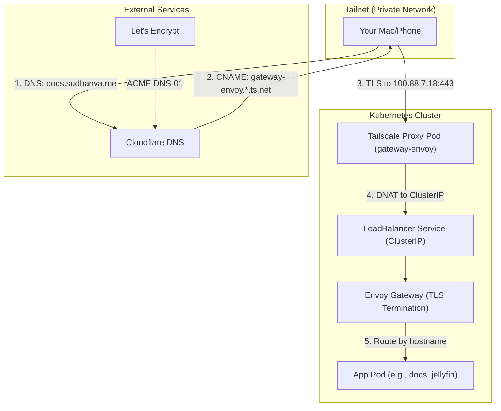
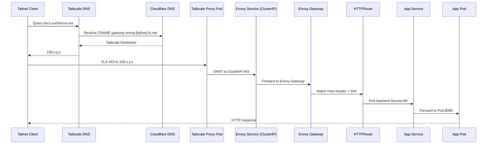

# Gateway API and Networking

This document explains how traffic flows from your Tailnet clients to applications running in the cluster.

## Overview

The homelab uses a layered approach to expose HTTPS services:



## Detailed Request Path



## Control Plane Objects and Ownership

```mermaid
flowchart LR
  subgraph DNS["DNS + TLS"]
    CF["Cloudflare DNS zone"]
    LE["Let's Encrypt"]
    Issuer["ClusterIssuer"]
    Cert["Certificate (wildcard)"]
  end

  subgraph Tailscale["Tailscale"]
    Operator["Tailscale Operator"]
    ProxySvc["Envoy Service (LoadBalancer class)"]
    ProxyPod["Proxy Pod (gateway-envoy)"]
  end

  subgraph Gateway["Gateway API"]
    GatewayClass["GatewayClass tailscale"]
    Gateway["Gateway tailscale-gateway"]
    EnvoyProxy["EnvoyProxy"]
    HTTPRoute["HTTPRoute (apps/*/httproute.yaml)"]
  end

  CF --> Issuer
  Issuer --> Cert
  Cert --> Gateway
  Operator --> ProxyPod
  ProxySvc --> ProxyPod
  EnvoyProxy --> ProxySvc
  GatewayClass --> Gateway
  Gateway --> HTTPRoute
  HTTPRoute --> ProxySvc
  LE -.-> CF
```

## Components

### Tailscale Operator

The Tailscale Kubernetes Operator creates proxy pods for `LoadBalancer` services when `spec.loadBalancerClass: tailscale` is set. Each proxy pod:

- Joins your Tailnet as a device (e.g., `gateway-envoy`)
- Gets a Tailscale IP (e.g., `100.88.7.18`)
- Uses iptables DNAT to forward traffic to the Kubernetes ClusterIP

### Envoy Gateway

Envoy Gateway implements the Gateway API and handles:

- TLS termination using certificates from cert-manager
- SNI-based routing to select the correct filter chain
- HTTPRoute matching to forward requests to backend services

The `EnvoyProxy` resource configures the Envoy deployment as a `LoadBalancer` with `loadBalancerClass: tailscale`, which triggers the Tailscale Operator to create the proxy.

### ExternalDNS

ExternalDNS watches HTTPRoute resources with the annotation `external-dns.alpha.kubernetes.io/expose: "true"` and creates DNS records in Cloudflare:

- Subdomain CNAMEs (e.g., `docs.sudhanva.me`)
- Pointing to the Tailscale hostname (`gateway-envoy.`<tailnet>`.ts.net`)

### cert-manager

cert-manager obtains wildcard TLS certificates from Let's Encrypt using DNS-01 challenges:

- The `ClusterIssuer` is configured with a Cloudflare API token
- A single `Certificate` resource covers `*.sudhanva.me`
- The certificate is stored in a Secret and referenced by the Gateway

## Required wiring for Tailnet ingress

These resources have to align or HTTPS routing through Tailscale will break:

- Cilium runs with `kubeProxyReplacement=true` and `socketLB.hostNamespaceOnly=true` so the Tailscale proxy DNAT works.
- EnvoyProxy exposes a `LoadBalancer` service with `loadBalancerClass: tailscale` and a stable Tailscale hostname.
- Gateway uses `gatewayClassName: tailscale` and points to the wildcard certificate.
- ExternalDNS targets the Tailscale hostname via the Gateway annotation.
- cert-manager creates the wildcard certificate in the `tailscale` namespace.
- HTTPRoutes live in app namespaces and include the ExternalDNS expose annotation.
- Cloudflare API tokens and Tailscale OAuth credentials are synced from Vault through External Secrets Operator.

## Split-horizon DNS for public hostnames

Some hostnames need different targets on and off the tailnet. For example, `docs.sudhanva.me` should resolve to the cluster on tailnet clients and to Cloudflare Pages for public clients.

To make this work:

- Keep the public Cloudflare DNS record pointing at Pages.
- Route tailnet DNS through the `tailscale-dns` resolver, which rewrites `*.sudhanva.me` to the Tailscale Gateway hostname and resolves it via Tailscale DNS.
- Do not annotate the HTTPRoute with `external-dns.alpha.kubernetes.io/expose: "true"` so ExternalDNS does not overwrite the public record.

## Quick validation commands

Run these from any kubectl context that can reach the cluster:

```bash
kubectl get gatewayclass
kubectl get gateways -n tailscale
kubectl get envoyproxy -n tailscale
kubectl get svc -n tailscale
kubectl get certificates -n tailscale
kubectl get pods -n tailscale
kubectl get pods -n envoy-gateway
kubectl get httproute -A
```

For the Cilium requirement:

```bash
cilium config view | grep -E "bpf-lb-sock|kubeProxyReplacement"
```

## Traffic Flow

When you visit `https://docs.sudhanva.me` from your Mac:

- **DNS Resolution**: Your Tailscale client queries Tailscale DNS (100.100.100.100), which knows that `docs.sudhanva.me` points to `gateway-envoy.`<tailnet>`.ts.net`, which resolves to `100.88.7.18`.

- **TLS Connection**: Your browser connects to `100.88.7.18:443` via the WireGuard tunnel. The Tailscale proxy pod receives the connection.

- **DNAT**: iptables rules in the proxy pod rewrite the destination from `100.88.7.18:443` to the ClusterIP `10.x.x.x:443`.

- **Cilium Processing**: With `socketLB.hostNamespaceOnly=true`, Cilium processes the DNAT'd packet at the tc layer (not socket layer) and routes it to the Envoy pod.

- **TLS Termination**: Envoy reads the SNI (`docs.sudhanva.me`) and selects the filter chain with the wildcard certificate.

- **HTTPRoute Matching**: Envoy matches the `Host` header to an HTTPRoute and forwards the request to the backend Service (e.g., `docs.docs.svc.cluster.local:80`).

## Key Configuration Files

| Component | Path | Purpose |
|-----------|------|---------|
| Gateway | `infrastructure/gateway/gateway.yaml` | Defines listeners and TLS |
| GatewayClass | `infrastructure/gateway/gatewayclass.yaml` | Links to EnvoyProxy |
| EnvoyProxy | `infrastructure/gateway/envoyproxy.yaml` | LoadBalancer + Tailscale |
| Certificate | `infrastructure/gateway/certificate.yaml` | Wildcard cert request |
| HTTPRoutes | `apps/*/httproute.yaml` | Per-app routing rules |

## Common Issues

### Cilium Socket LB Interference

When Cilium runs in kube-proxy replacement mode, its socket-level LoadBalancer intercepts connections in pod namespaces before iptables rules apply. This breaks the Tailscale proxy's DNAT.

**Fix:** Set `socketLB.hostNamespaceOnly=true` in Cilium. See [Cilium CNI](../tutorials/cilium.md).

### Missing SNI

Envoy requires Server Name Indication (SNI) to select the correct TLS certificate. If clients connect by IP without a hostname, Envoy logs `filter_chain_not_found`.

**Fix:** Always connect using the FQDN, not the Tailscale IP directly.

### Gateway shows not programmed

If `kubectl get gateways -n tailscale` reports `PROGRAMMED=False`, confirm:

- The GatewayClass points at `tailscale-proxy`.
- The EnvoyProxy service is `LoadBalancer` with `loadBalancerClass: tailscale`.
- The Tailscale Operator pod is running and can tag devices.

Reconcile by checking the Envoy Gateway controller logs:

```bash
kubectl logs -n envoy-gateway -l app.kubernetes.io/name=envoy-gateway --tail=200
```
