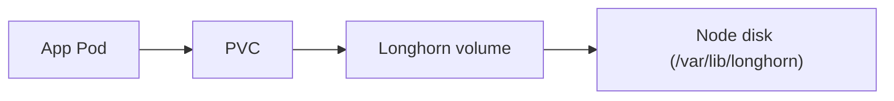
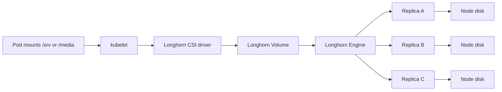

# Storage (Longhorn)



## Detailed Volume Path



## Step 1: Storage prerequisites for Longhorn

### Install Required Packages

```bash
sudo apt-get update
sudo apt-get install -y open-iscsi nfs-common cryptsetup
sudo systemctl enable --now iscsid
```

### Create Storage Directory

:::warning

Longhorn needs a storage directory to exist. Create it on your preferred disk.

:::

```bash
sudo mkdir -p /var/lib/longhorn
```

:::note

Update the matching path in `bootstrap/templates/longhorn.yaml` and `ansible/group_vars/all.yaml`.

:::

:::note

The default path is `/var/lib/longhorn` to avoid user-specific home directories.

:::

### Move Longhorn to a larger disk

If `/` is small and `/home` is on a larger disk, move Longhorn to `/home/longhorn`.

Step 1: Update the Longhorn path in Git.

Set the data path in both files:

```bash
ansible/group_vars/all.yaml
bootstrap/templates/longhorn.yaml
```

Use `/home/longhorn` as the path in both locations.

Step 2: Create the directory on the node.

```bash
sudo mkdir -p /home/longhorn
sudo chown root:root /home/longhorn
sudo chmod 0755 /home/longhorn
```

Step 3: Recreate Longhorn.

Delete the Longhorn app and namespace, then reapply it so the new path takes effect.

Step 4: Recreate PVCs.

If you already created PVCs on the old path, delete them and let ArgoCD recreate them.
This is destructive if you have data.

:::note

Longhorn uses the `longhorn-critical` PriorityClass. This repo applies it from `infrastructure/longhorn/priorityclass.yaml`.

:::

### Add Node Label for Longhorn Disk

:::note

With `createDefaultDiskLabeledNodes: true`, Longhorn only creates disks on nodes with this label.

:::

:::note

For single-node clusters, set `defaultReplicaCount: 1` in `bootstrap/templates/longhorn.yaml` to avoid degraded volumes.

:::

:::note

If Longhorn volumes stay `detached` or PVCs remain Pending on small disks, reduce PVC sizes in Git so total requested storage fits on the node.

:::

```bash
kubectl label node $(hostname) node.longhorn.io/create-default-disk=true --overwrite
```

## Step 2: Resize PVCs safely

Longhorn supports volume expansion, but Kubernetes does not allow shrinking PVCs in place.

### Expanding a PVC

Update the PVC size in Git and let ArgoCD sync. Longhorn will expand the volume and filesystem.

### Reducing a PVC size (migration required)

To reduce a volume size without data loss, create a new PVC at the smaller size and copy data across.

- Create a new PVC with the target size (for example `jellyfin-media-200`).
- Create a temporary Pod that mounts both the old and new PVCs.
- Copy data across and verify checksums.
- Update the Deployment to use the new PVC.
- Remove the old PVC once validated.

Example copy pod (replace names and namespaces):

```yaml
apiVersion: v1
kind: Pod
metadata:
  name: pvc-migration
  namespace: media
spec:
  restartPolicy: Never
  containers:
    - name: rsync
      image: docker.io/library/alpine:3.20
      command: ["/bin/sh", "-c"]
      args:
        - apk add --no-cache rsync && rsync -aHAX --info=progress2 /old/ /new/
      volumeMounts:
        - name: old
          mountPath: /old
        - name: new
          mountPath: /new
  volumes:
    - name: old
      persistentVolumeClaim:
        claimName: jellyfin-media
    - name: new
      persistentVolumeClaim:
        claimName: jellyfin-media-200
```

## Step 3: Import media data into Longhorn

For large datasets, use `rsync` to copy from your workstation to the node, then move the data into the PVC mount. This avoids `kubectl cp` timeouts and supports resume.

### Step 1: Sync data to the node (resumable)

```bash
rsync -av --partial --inplace --progress /path/to/Videos/ user@node:/home/user/media-import/
```

Re-run the same command until it finishes; `rsync` will resume incomplete files.

### Step 2: Find the PVC mount path

```bash
POD_UID=$(kubectl -n media get pod -l app=jellyfin -o jsonpath='{.items[0].metadata.uid}')
PVC_ID=$(kubectl -n media get pvc jellyfin-media -o jsonpath='{.spec.volumeName}')
echo "/var/lib/kubelet/pods/${POD_UID}/volumes/kubernetes.io~csi/${PVC_ID}/mount"
```

### Step 3: Copy into the PVC

```bash
sudo rsync -av --delete /home/user/media-import/ /var/lib/kubelet/pods/<pod-uid>/volumes/kubernetes.io~csi/<pvc-id>/mount/Videos/
```

After the copy, Jellyfin should see the media under `/media/Videos`.
