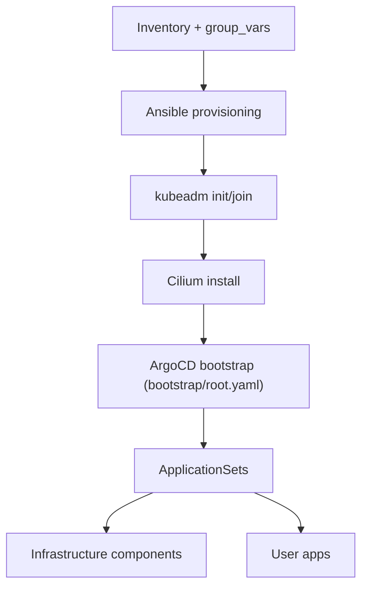
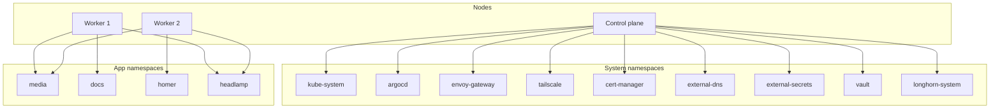

# Homelab

Multi-node bare-metal Kubernetes cluster on Ubuntu 24.04 LTS, managed via GitOps with ArgoCD.

## Quick Start

The primary goal of this repository is a bare-metal, multi-node cluster. The local VM path is a rehearsal option for testing changes before touching hardware.

### Bare Metal Deployment (Primary)

Deploy to real Ubuntu 24.04 hardware with SSH access.

**Three commands:**

```bash
# 1. Edit inventory with your IPs
nano ansible/inventory/hosts.yaml

# 2. Provision all nodes
ansible-playbook -i ansible/inventory/hosts.yaml ansible/playbooks/provision-cpu.yaml

# 3. Initialize control plane and install CNI (run on control plane node)
sudo kubeadm init --pod-network-cidr=10.244.0.0/16
mkdir -p $HOME/.kube
sudo cp -i /etc/kubernetes/admin.conf $HOME/.kube/config
sudo chown $(id -u):$(id -g) $HOME/.kube/config
kubectl taint nodes --all node-role.kubernetes.io/control-plane-
# Update k8sServiceHost in infrastructure/cilium/values.cilium to match the control plane IP
CILIUM_VERSION=$(grep -E "cilium_version:" ansible/group_vars/all.yaml | head -n 1 | awk -F'"' '{print $2}')
cilium install --version $CILIUM_VERSION --values infrastructure/cilium/values.cilium
```

Then bootstrap GitOps:

```bash
kubectl apply -k bootstrap/argocd
kubectl wait --for=condition=available --timeout=600s deployment/argocd-server -n argocd
kubectl apply -f bootstrap/root.yaml
```

ArgoCD will sync all infrastructure and apps from Git automatically.

**Detailed guide:** [Prerequisites](./tutorials/prerequisites.md) → [System Prep](./tutorials/system-prep.md) → [Kubernetes](./tutorials/kubernetes.md)

**Worker join steps:** [Join workers](./tutorials/join-workers.md)

## IP Address Conventions

This repo includes both real configuration values and placeholders that you must replace.

- Inventory IPs in `ansible/inventory/hosts.yaml` and `ansible/inventory/multipass.yaml` are always environment-specific.
- `k8sServiceHost` in `infrastructure/cilium/values.cilium` must match your control plane IP.
- `TAILSCALE_GATEWAY_IP` and `GATEWAY_ENVOY_HOSTNAME` in docs are placeholders for your Tailnet-provided values.
- `100.100.100.100` is the fixed Tailscale DNS resolver and should not be changed.

---

### Local Rehearsal (Optional)

Run a full multi-node cluster on your workstation using Multipass VMs. This mirrors the bare-metal setup without needing real hardware.

**One command:**

```bash
./scripts/local-cluster.sh up
```

This script:

- Creates 3 VMs (1 control plane, 2 workers)
- Runs Ansible provisioning
- Initializes Kubernetes with kubeadm
- Installs Cilium CNI
- Runs a smoke test

**Time:** ~10 minutes

**Prerequisites:** Multipass, Ansible, kubectl ([Install guide](./tutorials/local-multipass-cluster.md#step-1-install-host-tools))

When done, destroy with:

```bash
./scripts/local-cluster.sh down
```

## Cluster Bring-up Flow



## Cluster Topology (Logical)



## What Gets Deployed

Once ArgoCD syncs, you get:

| Component | Purpose |
|-----------|---------|
| **Cilium** | CNI with kube-proxy replacement |
| **ArgoCD** | GitOps continuous deployment |
| **Longhorn** | Distributed block storage |
| **Envoy Gateway** | Gateway API ingress controller |
| **Gateway API CRDs** | Required API types for Gateway API |
| **Envoy Gateway CRDs** | Required API types for Envoy Gateway |
| **Tailscale Operator** | VPN-based LoadBalancer |
| **cert-manager** | Automatic TLS certificates |
| **ExternalDNS** | Automatic DNS record management |
| **External Secrets CRDs** | CustomResourceDefinitions for External Secrets |
| **External Secrets Operator** | Syncs secrets from Vault |
| **Vault** | Central secrets storage |
| **Tailscale DNS** | Split-horizon DNS for tailnet clients |
| **Hubble UI** | Network visibility UI exposed through Gateway API |

## Repository Structure

```
homelab/
├── ansible/              # Node provisioning (Ansible)
│   ├── inventory/        # Host definitions
│   ├── playbooks/        # Playbook entrypoints
│   └── roles/            # Reusable roles
├── bootstrap/            # ArgoCD bootstrap
├── infrastructure/       # Cluster components (ArgoCD manages)
├── apps/                 # User workloads (ArgoCD manages)
├── clusters/             # Cluster-specific overrides
├── manifests/            # Legacy manifests (do not add new files)
├── scripts/              # Automation scripts
└── docs/                 # This documentation
```

## Reference Index

- [Infrastructure components](./reference/infrastructure-components.md)
- [Applications catalog](./reference/applications.md)

## Automation Model

Everything flows through two systems:

- **Ansible** provisions nodes (OS, container runtime, kubelet)
- **ArgoCD** applies cluster state from Git (helm charts, manifests)

Manual `kubectl apply` is discouraged. Push to Git and let ArgoCD reconcile.

Read more: [Automation Model](./explanation/automation-model.md)

## Day-2 Operations

After initial setup:

- [Deploy Apps With GitOps](./how-to/deploy-apps.md) - Add your own workloads
- [Tailscale Custom Domains](./how-to/tailscale.md) - Expose apps via HTTPS
- [Maintenance](./how-to/maintenance.md) - Upgrades and routine checks

## Deep Dives

- [Gateway API and Networking](./explanation/gateway-networking.md) - How traffic flows through Tailscale → Envoy → Apps
- [Local vs Bare Metal](./explanation/local-vs-baremetal.md) - Differences between Multipass and real hardware
