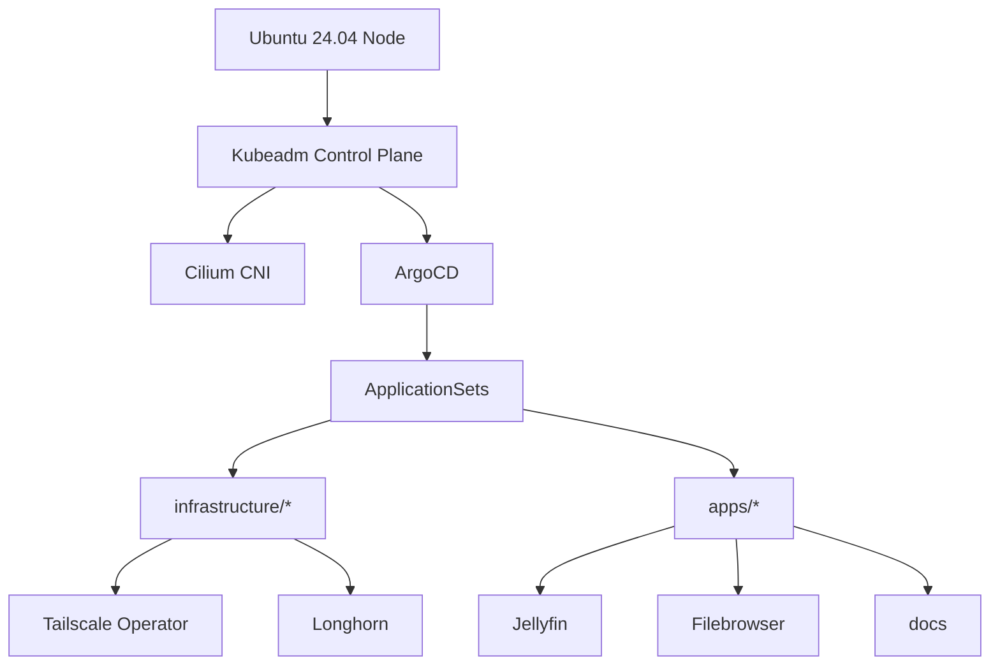
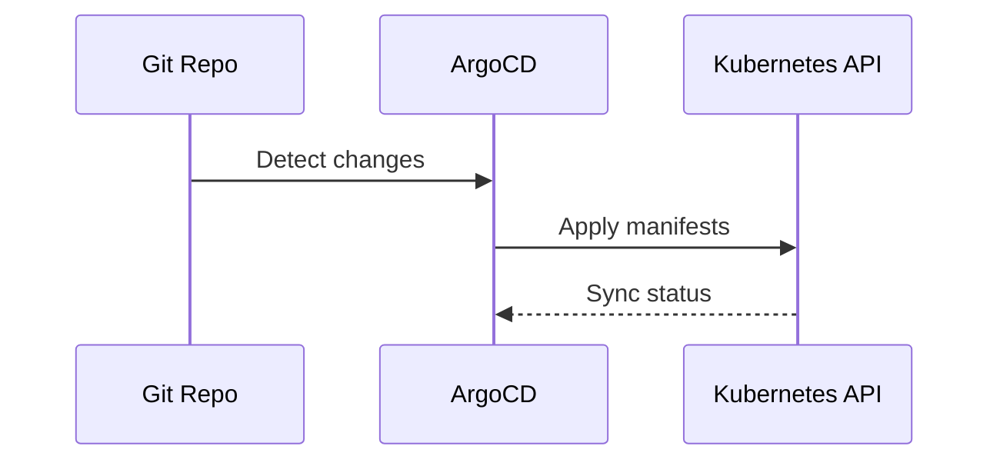

# Homelab Docs

Multi-node bare-metal Kubernetes cluster on Ubuntu 24.04 LTS, managed via GitOps with ArgoCD. These docs are organized to help you move from a local, VM-based rehearsal to a real machine while keeping the same Ansible and GitOps flow.

## Start Here

Pick the path that matches your environment, then follow the tutorials in order.

### Local rehearsal with Multipass

Use this when you want a close-to-real rehearsal on your workstation.

- Follow the local VM walkthrough in [Local Multipass Cluster](./tutorials/local-multipass-cluster.md)
- Read the differences in [Local Simulation vs Bare Metal](./explanation/local-vs-baremetal.md)

### Bare metal deployment

Use this when you are ready to install on a real Ubuntu host.

- Prepare the host in [Prerequisites](./tutorials/prerequisites.md) and [System Preparation](./tutorials/system-prep.md)
- Install containerd in [Install Containerd](./tutorials/containerd.md)
- Install Kubernetes and initialize the cluster in [Kubernetes](./tutorials/kubernetes.md)
- Install the CNI in [Cilium CNI](./tutorials/cilium.md)
- Install GitOps in [ArgoCD and GitOps](./tutorials/argocd.md)

## How This Repo Is Used

- Ansible provisions hosts in `ansible/`
- GitOps bootstrap lives in `bootstrap/`
- Infrastructure components are in `infrastructure/`
- Applications live in `apps/` and are synced into namespaces defined per app

For day-to-day usage, see [Deploy Apps With GitOps](./how-to/deploy-apps.md), [Validation](./how-to/validation.md), and [Maintenance](./how-to/maintenance.md).

Pinned versions live in [Version Matrix](./reference/versions.md).

## Day-2 Operations

If you plan to deploy once and leave it running, follow the Routine checks and Upgrade sections in [Maintenance](./how-to/maintenance.md).

## Automation First

The automation model is described in [Automation Model](./explanation/automation-model.md). Cluster changes go through ArgoCD, and host changes go through Ansible.

## Architecture

