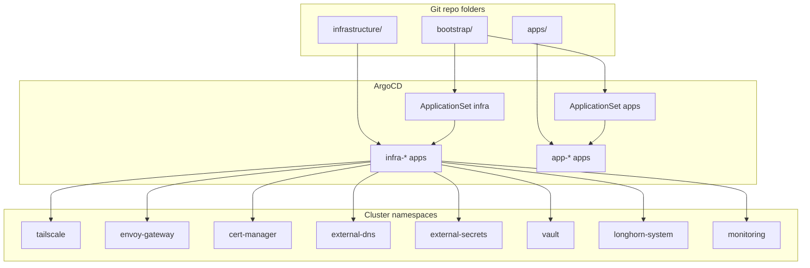

# Infrastructure Components

This page maps the infrastructure folders to their roles in the cluster.

## ArgoCD ApplicationSets

ApplicationSets watch `apps/` and `infrastructure/` and create ArgoCD Applications automatically.

- `bootstrap/templates/infra-appset.yaml`
- `bootstrap/templates/apps-appset.yaml`

## Core infrastructure

| Component | Path | Purpose | Notes |
| --- | --- | --- | --- |
| ArgoCD | `bootstrap/argocd/` | GitOps controller install | Apply once before bootstrap |
| Cilium | `infrastructure/cilium/` | CNI and kube-proxy replacement | Install once manually, ArgoCD manages after bootstrap |
| Cilium secrets namespace | `infrastructure/cilium-secrets/namespace.yaml` | Namespace for policy secrets | Required by Cilium config |
| Gateway API CRDs | `infrastructure/gateway-api-crds/gateway-api-crds.yaml` | Installs Gateway API CRDs | ArgoCD pulls upstream `config/crd` |
| Envoy Gateway CRDs | `infrastructure/envoy-gateway-crds/` | Installs Envoy Gateway CRDs | Kustomize pulls upstream CRD bundle |
| Envoy Gateway | `infrastructure/envoy-gateway/envoy-gateway.yaml` | Ingress controller for Gateway API | Helm chart with pinned image tag |
| Tailscale Operator | `infrastructure/tailscale/tailscale-operator.yaml` | Tailnet integration and LoadBalancer proxy pods | Requires `operator-oauth` Secret |
| cert-manager | `infrastructure/cert-manager/cert-manager.yaml` | TLS certificate management | Used with DNS-01 |
| ClusterIssuer | `infrastructure/cert-manager-issuer/cluster-issuer.yaml` | ACME issuer for wildcard certs | Update email and Cloudflare token |
| ExternalDNS | `infrastructure/external-dns/external-dns.yaml` | Creates DNS records for HTTPRoutes | Watches `external-dns.alpha.kubernetes.io/expose=true` |
| CoreDNS override | `infrastructure/coredns/configmap.yaml` | Rewrites `*.sudhanva.me` to `gateway-internal` | Split-horizon DNS for in-cluster access |
| Tailscale DNS | `infrastructure/tailscale-dns/` | Split-horizon DNS for tailnet clients | CoreDNS exposed via Tailscale LoadBalancer |
| External Secrets CRDs | `infrastructure/external-secrets-crds/` | Installs External Secrets CRDs | Kustomize pulls upstream CRD bundle |
| External Secrets Operator | `infrastructure/external-secrets/external-secrets.yaml` | Syncs secrets from Vault | ClusterSecretStore and ExternalSecret manifests live in `infrastructure/external-secrets/` |
| Gateway | `infrastructure/gateway/` | GatewayClass, Gateway, EnvoyProxy, cert, internal-service | Uses Tailscale `gatewayClassName` |
| Longhorn | `bootstrap/templates/longhorn.yaml` | Storage via Longhorn | Helm chart in ArgoCD |
| Vault | `infrastructure/vault/vault.yaml` | Central secrets storage | PVC on Longhorn |
| Hubble UI | `infrastructure/hubble-ui/httproute.yaml` | Exposes Hubble UI over Tailscale | HTTPRoute to `hubble-ui` service in `kube-system` |
| Prometheus Operator CRDs | `infrastructure/prometheus-operator-crds/` | Prometheus CRDs | Installed before the monitoring stack |
| Prometheus stack | `infrastructure/prometheus/` | Metrics, alerting, dashboards | Grafana, Prometheus, Alertmanager, and HTTPRoutes |
| GPU plugins | `infrastructure/gpu/` | Intel and NVIDIA device plugins | Optional, based on node hardware |

## Gateway and route definitions

Gateway resources are split by purpose:

- `infrastructure/gateway/gatewayclass.yaml`
- `infrastructure/gateway/gateway.yaml`
- `infrastructure/gateway/envoyproxy.yaml`
- `infrastructure/gateway/certificate.yaml`
- `infrastructure/gateway/internal-service.yaml`
- `infrastructure/gateway/argocd-httproute.yaml`
- `infrastructure/gateway/longhorn-httproute.yaml`
- `infrastructure/gateway/vault-httproute.yaml`
- `infrastructure/hubble-ui/httproute.yaml`
- `infrastructure/prometheus/httproute-grafana.yaml`
- `infrastructure/prometheus/httproute-prometheus.yaml`
- `infrastructure/prometheus/httproute-alertmanager.yaml`

HTTPRoutes for apps live alongside each app under `apps/*/httproute.yaml`.
