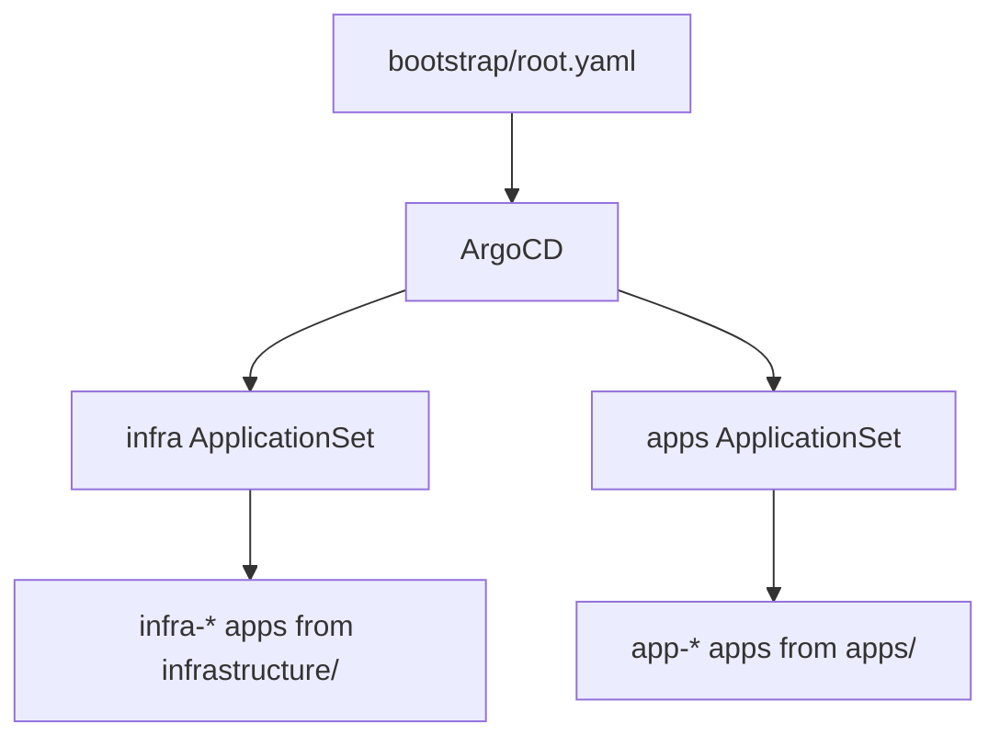
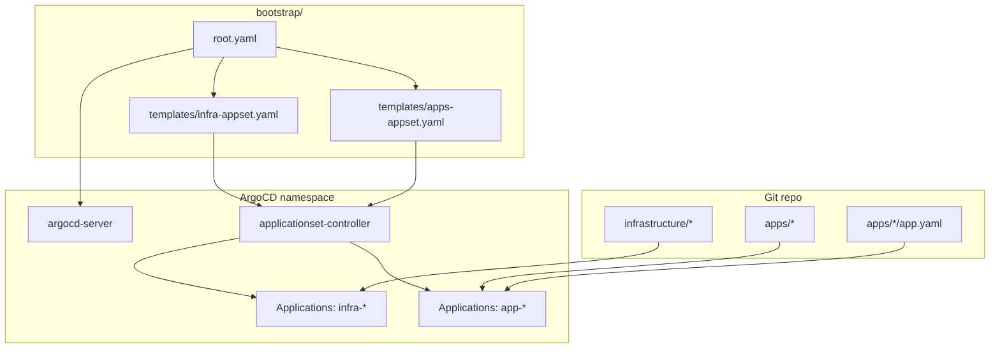

# ArgoCD and GitOps

## Step 1: Install ArgoCD

```bash
kubectl apply -k bootstrap/argocd
kubectl wait --for=condition=available --timeout=600s deployment/argocd-server -n argocd
kubectl -n argocd get secret argocd-initial-admin-secret -o jsonpath='{.data.password}' | base64 -d; echo
```

:::note

ArgoCD is exposed via Gateway API in `infrastructure/gateway/argocd-httproute.yaml` (hostname: `argocd.sudhanva.me`).

:::

## Step 2: Prepare GitOps bootstrap

Update these files if you fork the repo. The default references point to `nsudhanva/homelab`:

- `bootstrap/root.yaml`
- `bootstrap/templates/infra-appset.yaml`
- `bootstrap/templates/apps-appset.yaml`
- `infrastructure/cilium/cilium.yaml`

Confirm the Longhorn data path in `bootstrap/templates/longhorn.yaml` matches your host.

:::note

If you deploy the docs app, also update the image in `apps/docs/deployment.yaml` and the repository links in `docs/docusaurus.config.ts`.

:::



## Detailed ApplicationSet Wiring



## Step 3: Apply the bootstrap

```bash
kubectl apply -f bootstrap/root.yaml
```

## Step 4: Verify ArgoCD applications

```bash
kubectl get apps -n argocd
```

For adding workloads, see [Deploy Apps With GitOps](../how-to/deploy-apps.md).

## How ApplicationSets work

ApplicationSets watch the `apps/` and `infrastructure/` folders and create applications automatically:

- `apps/*/app.yaml` defines `app-<name>` and its namespace
- `infrastructure/*` becomes `infra-<folder>`

Auto-sync is enabled in the ApplicationSets, so Git is the source of truth.
