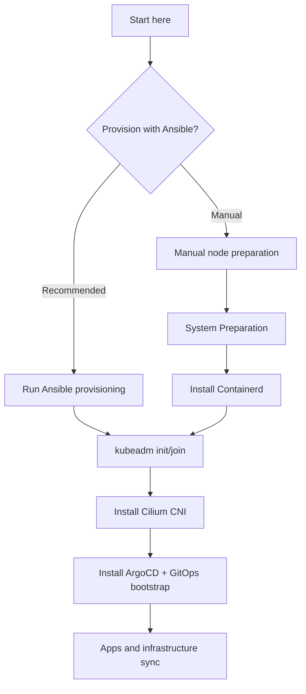

# Tutorials

:::note

Ansible provisioning handles system prep, containerd, and Kubernetes packages. It does not run `kubeadm init/join` or install Cilium/ArgoCD.

:::

## Ansible path (recommended)

- Step 1: [Prerequisites](./prerequisites.md) for workstation setup, inventory, and provisioning
- Step 2: [Kubernetes](./kubernetes.md) to initialize the control plane
- Step 3: [Cilium CNI](./cilium.md) to install the CNI and remove kube-proxy
- Step 4: [ArgoCD and GitOps](./argocd.md) to bootstrap GitOps
- Step 5: [Join Worker Nodes](./join-workers.md) to add workers

## Manual path (advanced)

- Step 1: [Prerequisites](./prerequisites.md) for workstation setup and inventory
- Step 2: [System Preparation](./system-prep.md) for swap, kernel modules, and sysctl
- Step 3: [Install Containerd](./containerd.md) for the container runtime
- Step 4: [Kubernetes](./kubernetes.md) to initialize the control plane
- Step 5: [Cilium CNI](./cilium.md) to install the CNI and remove kube-proxy
- Step 6: [ArgoCD and GitOps](./argocd.md) to bootstrap GitOps
- Step 7: [Join Worker Nodes](./join-workers.md) to add workers
