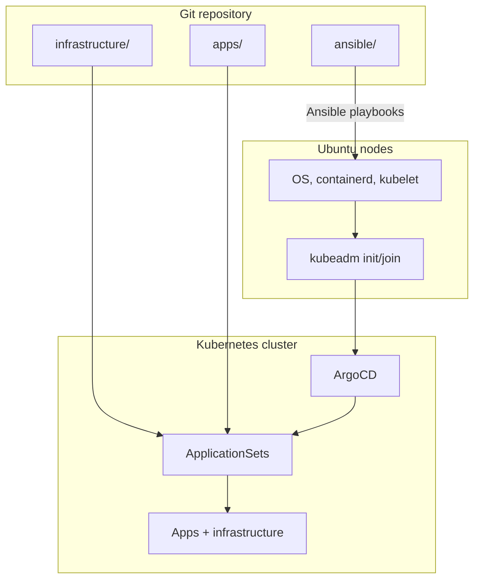
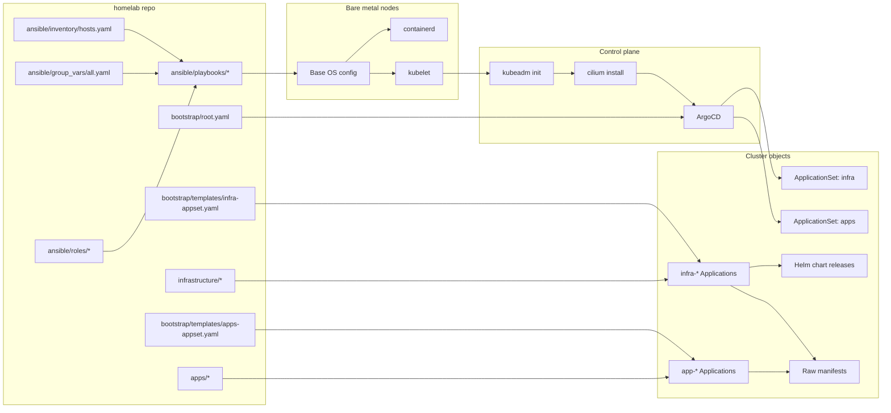

# Automation Model

This repository is designed for maximum automation. Every change should flow through one of two systems:

- **Ansible** for node and host configuration
- **ArgoCD** for cluster and application manifests

If a change does not fit into those two paths, treat it as an exception and document it.

## Detailed Automation Flow

## What Ansible owns

Ansible is the source of truth for host provisioning and OS configuration:

- Kernel modules and sysctl
- Container runtime configuration
- Kubernetes package installation and pinning
- Storage prerequisites and node services

## What ArgoCD owns

ArgoCD is the source of truth for everything that runs inside the cluster:

- Infrastructure from `infrastructure/`
- Applications from `apps/`
- Helm-based components like Longhorn

## Automation guardrails

:::note

Avoid running `kubectl apply` against app or infrastructure directories. Push to Git and let ArgoCD reconcile.

:::

:::note

Avoid manual edits on nodes. Update Ansible inputs and re-run the playbooks.

:::
