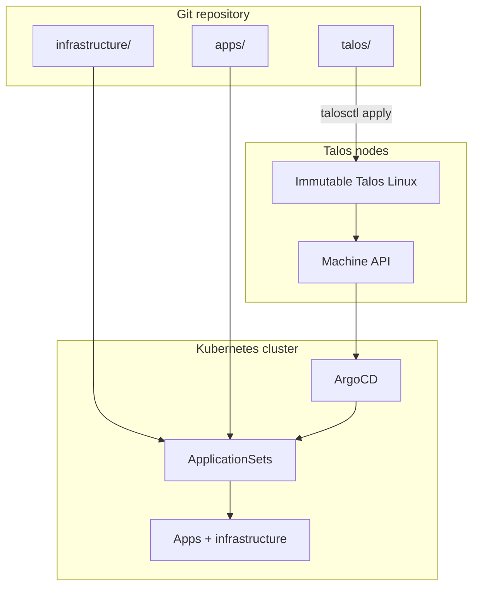
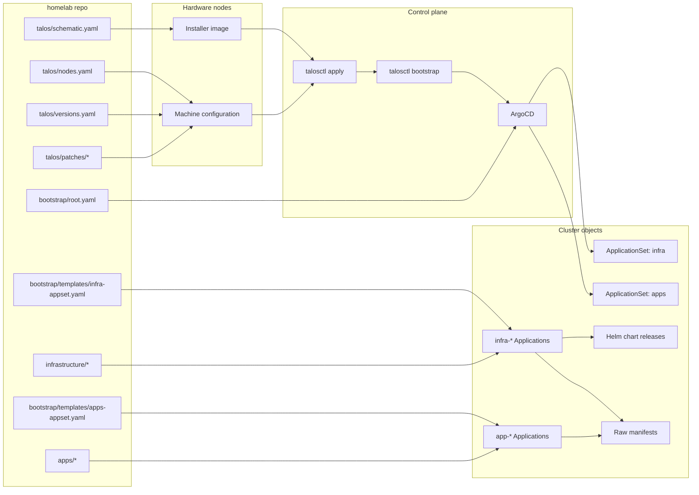

# Automation Model

This repository is designed for maximum automation. Every change flows through one of two systems:

- **Talos machine configuration** for node operating system and Kubernetes bootstrap
- **ArgoCD** for cluster and application manifests

If a change does not fit into those two paths, treat it as an exception and document it.

```mermaid
flowchart TB
  subgraph Git["Git repository"]
    TalosRepo["talos/"]
    InfraRepo["infrastructure/"]
    AppsRepo["apps/"]
  end

  subgraph Hosts["Talos nodes"]
    OS["Immutable Talos Linux"]
    API["Machine API"]
  end

  subgraph Cluster["Kubernetes cluster"]
    Argo["ArgoCD"]
    AppSets["ApplicationSets"]
    Workloads["Apps + infrastructure"]
  end

  TalosRepo -->|"talosctl apply"| OS
  OS --> API
  API --> Argo
  InfraRepo --> AppSets
  AppsRepo --> AppSets
  Argo --> AppSets
  AppSets --> Workloads
```

## Detailed Automation Flow

```mermaid
flowchart LR
  subgraph Repo["homelab repo"]
    Nodes["talos/nodes.yaml"]
    Versions["talos/versions.yaml"]
    Schematic["talos/schematic.yaml"]
    Patches["talos/patches/*"]
    Bootstrap["bootstrap/root.yaml"]
    AppSetInfra["bootstrap/templates/infra-appset.yaml"]
    AppSetApps["bootstrap/templates/apps-appset.yaml"]
    InfraDir["infrastructure/*"]
    AppsDir["apps/*"]
  end

  subgraph Hosts["Hardware nodes"]
    Image["Installer image"]
    MachineConfig["Machine configuration"]
  end

  subgraph ControlPlane["Control plane"]
    TalosApply["talosctl apply"]
    TalosBootstrap["talosctl bootstrap"]
    ArgoCD["ArgoCD"]
  end

  subgraph Cluster["Cluster objects"]
    AppSet1["ApplicationSet: infra"]
    AppSet2["ApplicationSet: apps"]
    InfraApps["infra-* Applications"]
    UserApps["app-* Applications"]
    HelmCharts["Helm chart releases"]
    RawManifests["Raw manifests"]
  end

  Nodes --> MachineConfig
  Versions --> MachineConfig
  Schematic --> Image
  Patches --> MachineConfig
  Image --> TalosApply
  MachineConfig --> TalosApply
  TalosApply --> TalosBootstrap
  TalosBootstrap --> ArgoCD
  Bootstrap --> ArgoCD
  ArgoCD --> AppSet1
  ArgoCD --> AppSet2
  AppSetInfra --> InfraApps
  AppSetApps --> UserApps
  InfraDir --> InfraApps
  AppsDir --> UserApps
  InfraApps --> HelmCharts
  InfraApps --> RawManifests
  UserApps --> RawManifests
```

## What Talos owns

Talos machine configuration is the source of truth for nodes:

- Immutable OS image with storage system extensions
- Kubernetes version and control plane settings
- CNI and kube-proxy delegation to Cilium
- Node labels for workload placement

## What ArgoCD owns

ArgoCD is the source of truth for everything that runs inside the cluster:

- Infrastructure from `infrastructure/`
- Applications from `apps/`
- Helm-based components like Longhorn

## Automation guardrails

:::note

Avoid running `kubectl apply` against app or infrastructure directories. Push to Git and let ArgoCD reconcile.

:::

:::note

Avoid manual changes on nodes. Update the Talos inputs and re-apply through the API.

:::
