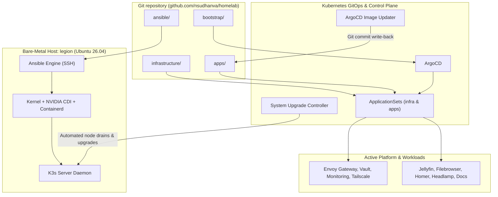

# Automation Model

This repository is built for 100% infrastructure-as-code and GitOps automation. Every layer of the homelab is declarative and automated through defined control loops:

- **Ansible Automation (`ansible/`)**: Provisions bare-metal Ubuntu hosts, kernel parameters, container runtime with NVIDIA CDI, and initial K3s bootstrap.
- **ArgoCD GitOps Engine (`bootstrap/`, `infrastructure/`, `apps/`)**: Continuously reconciles all cluster infrastructure and user applications against git HEAD.
- **Rancher System Upgrade Controller (`infrastructure/system-upgrade-controller/`)**: Declaratively orchestrates rolling K3s upgrades via Kubernetes Custom Resources (`Plan`).
- **ArgoCD Image Updater (`infrastructure/argocd-image-updater/`)**: Scans container registries and automatically commits updated image tags back to git.


```mermaid
flowchart TB
  subgraph Git["Git repository (github.com/nsudhanva/homelab)"]
    AnsibleRepo["ansible/"]
    InfraRepo["infrastructure/"]
    AppsRepo["apps/"]
    BootRepo["bootstrap/"]
  end

  subgraph HostLayer["Bare-Metal Host: legion (Ubuntu 26.04)"]
    Ansible["Ansible Engine (SSH)"]
    Host["Kernel + NVIDIA CDI + Containerd"]
    K3s["K3s Server Daemon"]
  end

  subgraph GitOpsLayer["Kubernetes GitOps & Control Plane"]
    Argo["ArgoCD"]
    AppSets["ApplicationSets (infra & apps)"]
    SUC["System Upgrade Controller"]
    ImgUpdater["ArgoCD Image Updater"]
  end

  subgraph Workloads["Active Platform & Workloads"]
    Infra["Envoy Gateway, Vault, Monitoring, Tailscale"]
    Apps["Jellyfin, Filebrowser, Homer, Headlamp, Docs"]
  end

  AnsibleRepo --> Ansible
  Ansible --> Host
  Host --> K3s
  BootRepo --> Argo
  InfraRepo --> AppSets
  AppsRepo --> AppSets
  Argo --> AppSets
  AppSets --> Infra
  AppSets --> Apps
  SUC -->|Automated node drains & upgrades| K3s
  ImgUpdater -->|Git commit write-back| AppsRepo
```

## Layer 1: Host and Control Plane Automation (Ansible)

Host configuration is completely reproducible via Ansible roles:

- `ansible/roles/common/`: Installs OS packages, loads kernel modules (`overlay`, `br_netfilter`), tunes sysctl networking, and prepares `/home/k3s-storage`.
- `ansible/roles/nvidia/`: Configures the NVIDIA Container Toolkit and generates CDI specifications (`/etc/cdi/nvidia.yaml`).
- `ansible/roles/k3s_server/`: Deploys K3s server with configured flags (`default-runtime: "nvidia"`, `default-local-storage-path: "/home/k3s-storage"`).
- `ansible/roles/argocd/`: Bootstraps the ArgoCD control plane and applies `bootstrap/root.yaml`.

## Layer 2: In-Cluster Declarative GitOps (ArgoCD)

ArgoCD acts as the primary reconcile loop. The single root application `bootstrap/root.yaml` creates two core ApplicationSets:

- `infra-appset.yaml`: Watches every directory in `infrastructure/*` and generates individual `infra-<component>` applications.
- `apps-appset.yaml`: Discovers application definitions in `apps/*/app.yaml` and provisions workloads into their target namespaces.

Both ApplicationSets enforce automated pruning and self-healing:

```yaml
syncPolicy:
  automated:
    prune: true
    selfHeal: true
```

## Layer 3: Automated Lifecycle & Image Updates

- **System Upgrade Controller**: Eliminates manual node patching. When a new K3s version tag is set in `k3s-upgrade-plan.yaml`, the controller orchestrates node cordon, drain, in-place binary upgrade, and uncordon.
- **Image Updater**: Tracks upstream semantic tags or digests, testing container registries on a schedule and pushing Git commits back to `master`.
