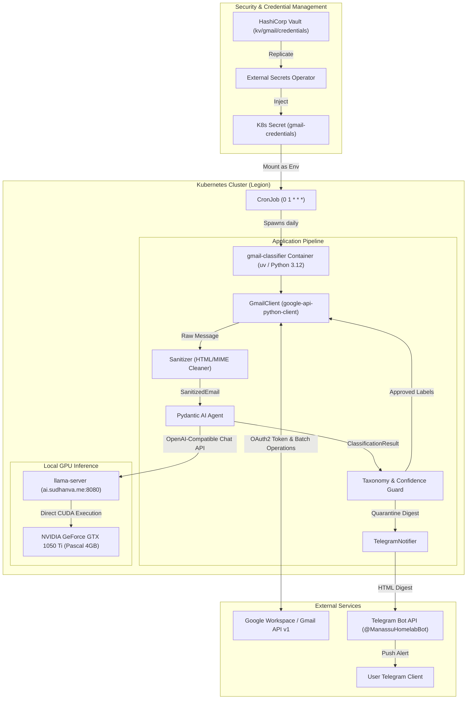
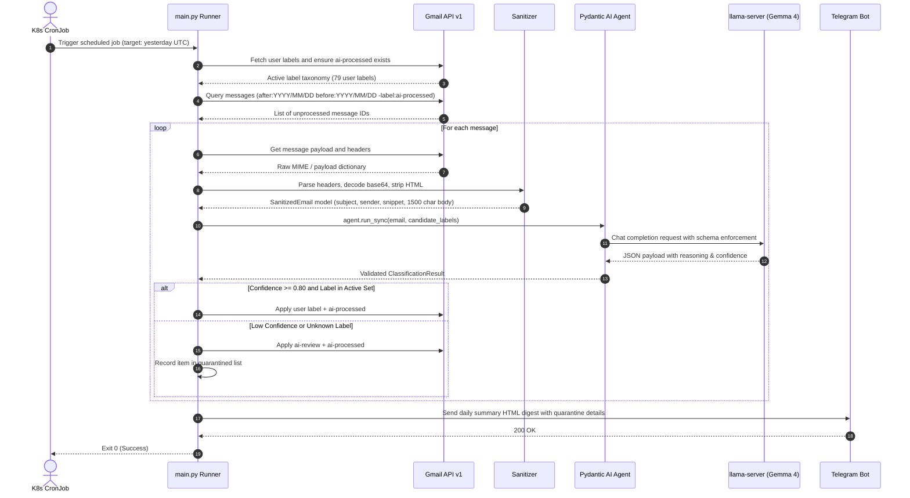
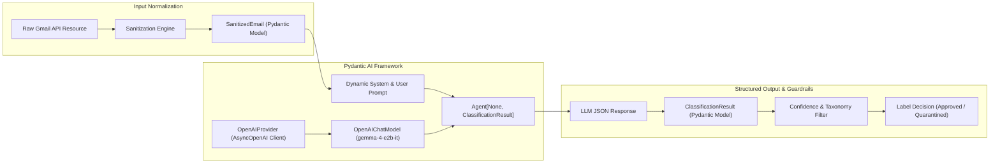
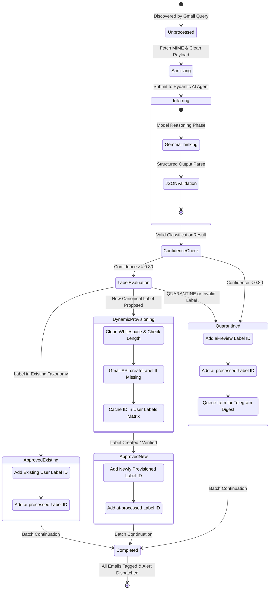

## Overview

The Gmail Classifier is an automated, GitOps-managed email triage engine deployed as a Kubernetes CronJob. It runs daily at 01:00 UTC, inspects messages received over the previous day, cleans and sanitizes email bodies, and passes them to a local in-cluster large language model (Google Gemma 4 E2B running on an NVIDIA GeForce GTX 1050 Ti) via **Pydantic AI**.

The classification engine enforces strict taxonomy safety: it categorizes incoming mail strictly into existing user-curated labels, quarantine-flagging any uncertain or ambiguous emails under `ai-review` without polluting root labels. Upon completion, a formatted summary report is dispatched to Telegram.



---

## Daily Execution Sequence

The classifier executes unattended through a deterministic sequence. If any single message encounter an API error or network timeout, the failure is caught and logged, the failed item is registered for manual review, and the remaining emails are processed without interrupting Telegram digest generation.



---

## Pydantic & Pydantic AI Integration

The application relies on **Pydantic** for data validation and **Pydantic AI** for structured output generation and model interactions.



### Type-Safe Data Contracts

Data structures are strongly typed Pydantic models:

- `SanitizedEmail`: Captures email metadata, sender, clean subject, decoded body, and snippet.
- `ClassificationResult`: Defines the exact output schema expected from the model, including label name, confidence score between 0.0 and 1.0, and reasoning explanation.

```python
from pydantic import BaseModel, Field


class ClassificationResult(BaseModel):
    label: str = Field(description="Selected Gmail label or quarantine fallback")
    confidence: float = Field(
        ge=0.0, le=1.0, description="Confidence score between 0.0 and 1.0"
    )
    reason: str = Field(description="Brief explanation of classification decision")
```

### Agent Configuration

The `EmailClassifier` provisions an `Agent` connected to the local inference server using `OpenAIChatModel`:

```python
from openai import AsyncOpenAI
from pydantic_ai import Agent
from pydantic_ai.models.openai import OpenAIChatModel
from pydantic_ai.providers.openai import OpenAIProvider

client = AsyncOpenAI(base_url=self.base_url, api_key="not-needed", timeout=self.timeout)
provider = OpenAIProvider(openai_client=client)
model = OpenAIChatModel(self.model_name, provider=provider)

self.agent = Agent(
    model=model,
    output_type=ClassificationResult,
    system_prompt=(
        "You are an automated email triage system.\n"
        "Categorize the provided email into EXACTLY ONE of the active user labels.\n"
        "If none of the candidate labels match with high confidence, choose 'QUARANTINE'.\n"
        "Keep your reasoning brief (1-2 sentences)."
    ),
)
```

---

## Label Safety & Autonomous Taxonomy Discovery

User labels are protected against corruption while allowing intelligent taxonomy evolution for accounts with sparse labels.

### Autonomous Label Discovery

When an account possesses few or no pre-existing user labels, or when incoming emails do not match any candidate labels, the classifier activates autonomous label discovery (`ALLOW_LABEL_CREATION=true`):

- **Canonical Proposing**: The model is instructed to propose concise, high-level canonical category labels (such as `Newsletters`, `Travel`, `Entertainment`, `Shopping`, `Finance`, `Social`) based on primary sender intent rather than dumping legitimate mail into quarantine.
- **Strict Guardrails**: New labels must be Title Case and broad (one to two words). Sender-specific company names (such as `Netflix` or `Uber`) are barred to avoid taxonomy fragmentation. Labels are trimmed, bounded to $\le 40$ characters, and forbidden from using reserved prefixes like `CATEGORY_`.
- **Dynamic Provisioning**: Once sanitized, the classifier calls `ensure_label_exists` on the Gmail API, creates the label if absent, and caches its label ID for subsequent batch operations.
- **Preserved Quarantine Safety**: Emails identified as unsolicited spam, phishing, or ambiguous noise continue to receive the explicit `QUARANTINE` label, mapping safely to `ai-review`.



---

## Automated 90-Day Archiving Sweep

To maintain a clean, high-signal inbox without manual maintenance, the classifier includes an automated archiving sweep executed immediately following daily classification:

- **Target Query**: Evaluates messages in the inbox that have been successfully classified but are older than ninety days:

  ```text
  in:inbox label:ai-processed -label:ai-review older_than:90d
  ```

- **Strict Quarantine Preservation**: Messages tagged with `ai-review` are explicitly excluded from automatic archiving (`-label:ai-review`), ensuring pending items requiring human review remain visible in the inbox.
- **High-Throughput Batch Processing**: Utilizes the Gmail API `batchModify` endpoint to remove the `INBOX` label across up to 1,000 messages per request, requiring zero LLM inference tokens.
- **Telemetry & Digest Reporting**: The total number of archived emails is included directly in the Telegram summary report (`📦 Archived from Inbox: <count>`).

---

## Security & Secrets Management

- **Zero Secret Exposure**: No refresh tokens or OAuth secrets are stored in version control. All secrets are stored in HashiCorp Vault at `kv/gmail/credentials` and synchronized via an `ExternalSecret` into Kubernetes Secret `gmail-credentials`.
- **Restricted Container Capabilities**: The container runs under non-root UID/GID `10001:10001`, mounts a read-only root filesystem, drops all POSIX capabilities, and utilizes the `RuntimeDefault` seccomp profile.
- **Privacy Preservation**: Email contents are processed completely inside the local cluster network (`http://llama-server.llama.svc.cluster.local:8080/v1`). No personal correspondence or headers ever leave the local network for third-party inference APIs.
- **Fail-Safe Processing**: Transient Google API failures on individual emails are caught gracefully. The pipeline logs the failure, marks the message for human attention, and proceeds through the rest of the queue to guarantee summary alert delivery.

---

## Observability & Grafana Dashboard

A dedicated, zero-PII Grafana dashboard is provisioned in the `monitoring` namespace via `infrastructure/prometheus/dashboard-gmail-classifier.yaml` (labeled `grafana_dashboard: "1"` for automatic discovery by the Grafana sidecar).

- **Executive KPI Cards**: Real-time visibility into CronJob schedule status (`0 1 * * *`), total successful jobs, failure counts, active batch workers, and last execution duration.
- **Batch Execution Lifecycle**: Historical run duration and Pod lifecycle phase state timelines (`Running`, `Succeeded`, `Failed`).
- **Resource Footprint**: Container CPU usage and memory working set metrics tracked against container requests (100m / 128Mi) and limits (500m / 384Mi).
- **SLM Hardware Acceleration**: Correlated NVIDIA GTX 1050 Ti GPU compute utilization %, VRAM framebuffer allocation (MB), core temperature, and compute clock speeds during inference cycles.
- **Zero-PII Privacy Posture**: No email bodies, subjects, sender emails, or personal identifiers are stored in Prometheus or displayed on dashboards, ensuring personal privacy is strictly preserved.
