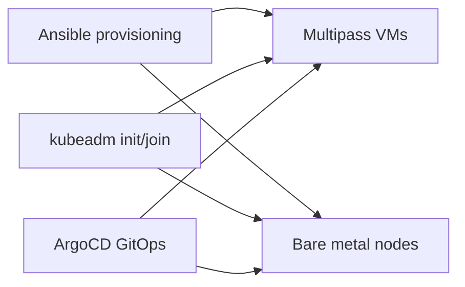
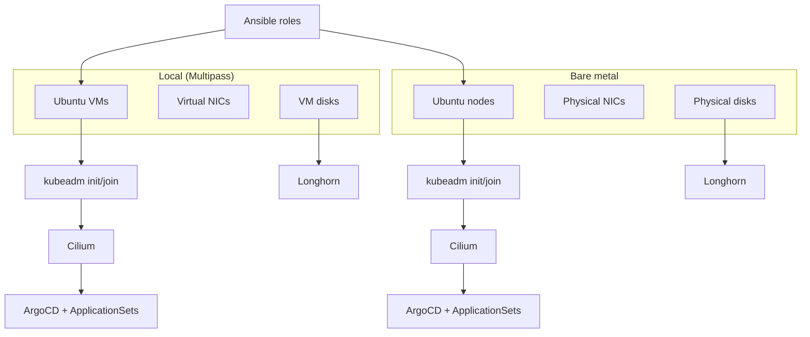

# Local Simulation vs Bare Metal

This document explains how the Multipass-based local cluster differs from a bare-metal deployment.

## Detailed Environment Parity

## Differences at a glance

| Feature | Local (Multipass VM) | Bare Metal (Production) |
| :--- | :--- | :--- |
| Kernel | VM kernel, virtualized | Dedicated kernel on hardware |
| Init system | Native systemd (PID 1) | Native systemd (PID 1) |
| File system | Virtual disk image | Native filesystem |
| Networking | Virtual NICs, NAT or bridge | Physical NICs |
| Gateway API | Tailscale in VM | Tailscale on host |

## Kernel and modules

Multipass VMs run their own kernels, so module loading and sysctl tuning happen inside the VM. Bare metal applies the same steps directly on hardware.

## Networking model

Multipass uses virtual networking, which is closer to real host networking than containers but still differs from physical NICs, routing, and latency characteristics.

## Storage behavior

Local clusters use VM disk images. Bare metal uses the host filesystem and persistent storage systems like Longhorn.

## How close is it to real hardware

The Multipass workflow exercises the same kubeadm flow, systemd services, container runtime configuration, kernel modules, and CNI behavior as a physical node. It is a strong approximation for validating playbooks and cluster bootstrap logic.

## What it does not test

- Physical NIC throughput, offload behavior, and switch topology
- Firmware, BIOS, and power management quirks
- Disk controller performance and SMART behavior
- Tailscale exit node performance on real uplinks

## Moving from Multipass to bare metal

The migration path keeps the same Ansible roles and GitOps layout and switches only the host inventory and hardware assumptions.

### Prepare the bare metal host

Follow [Prerequisites](../tutorials/prerequisites.md) and [System Preparation](../tutorials/system-prep.md) on the real machine.

### Switch inventory

Update `ansible/inventory/hosts.yaml` with the bare metal host IPs and user, then run the provisioning playbook again.

### Bootstrap the cluster

Follow [Kubernetes](../tutorials/kubernetes.md), [Cilium CNI](../tutorials/cilium.md), and [ArgoCD and GitOps](../tutorials/argocd.md).
