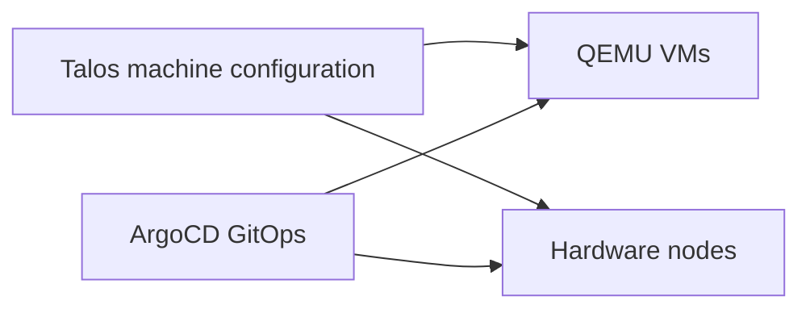
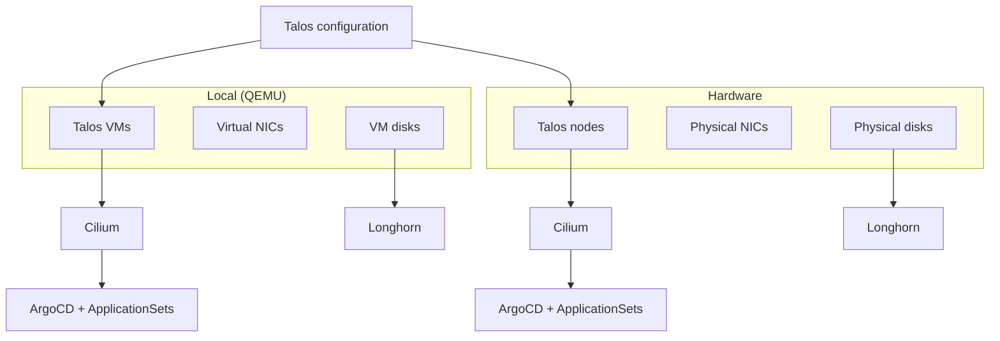

# Local Rehearsal vs Hardware

This document explains how the local Talos QEMU cluster differs from a hardware deployment.

```mermaid
flowchart LR
  TalosConfig["Talos machine configuration"] --> Local["QEMU VMs"]
  TalosConfig --> Bare["Hardware nodes"]
  GitOps["ArgoCD GitOps"] --> Local
  GitOps --> Bare
```

## Detailed Environment Parity

```mermaid
flowchart TB
  subgraph Local["Local (QEMU)"]
    VMs["Talos VMs"]
    VirtualNIC["Virtual NICs"]
    VirtualDisk["VM disks"]
  end

  subgraph Bare["Hardware"]
    Nodes["Talos nodes"]
    PhysicalNIC["Physical NICs"]
    PhysicalDisk["Physical disks"]
  end

  TalosConfig["Talos configuration"] --> VMs
  TalosConfig --> Nodes
  VMs --> CiliumLocal["Cilium"]
  Nodes --> CiliumBare["Cilium"]
  CiliumLocal --> GitOpsLocal["ArgoCD + ApplicationSets"]
  CiliumBare --> GitOpsBare["ArgoCD + ApplicationSets"]
  VirtualDisk --> LonghornLocal["Longhorn"]
  PhysicalDisk --> LonghornBare["Longhorn"]
```

## Differences at a glance

| Feature | Local (QEMU VM) | Hardware (Production) |
| :--- | :--- | :--- |
| OS | Immutable Talos Linux | Immutable Talos Linux |
| Init system | Talos machined (API-driven) | Talos machined (API-driven) |
| File system | Virtual disk image | Native filesystem |
| Networking | Virtual NICs, NAT or bridge | Physical NICs |
| Gateway API | Tailscale in VM | Tailscale on host |

## OS and configuration

Both environments run the same immutable Talos image built from the repo schematic. Machine configuration renders from the same patches, so OS behavior matches by construction.

## Networking model

QEMU uses virtual networking, which is closer to real host networking than containers but still differs from physical NICs, routing, and latency characteristics.

## Storage behavior

Local clusters use VM disk images. Hardware uses the host disks and persistent storage systems like Longhorn.

## How close is it to real hardware

The QEMU workflow exercises the same Talos API flow, machine configuration rendering, CNI behavior, and GitOps bootstrap as a physical node. It is a strong approximation for validating configuration and cluster bootstrap logic.

## What it does not test

- Physical NIC throughput, offload behavior, and switch topology
- Firmware, BIOS, and power management quirks
- Disk controller performance and SMART behavior
- Tailscale exit node performance on real uplinks

## Moving from rehearsal to hardware

The migration path keeps the same Talos configuration and GitOps layout and switches only the machine inventory.

### Prepare the hardware

Follow [Prerequisites](../tutorials/prerequisites.md) and [Boot Media](../tutorials/system-prep.md) on the real machine.

### Switch inventory

Update `talos/nodes.yaml` with the hardware hostnames, IPs, and install disks, then render the configuration again.

### Bootstrap the cluster

Follow [Talos Bootstrap](../tutorials/kubernetes.md), [Cilium CNI](../tutorials/cilium.md), and [ArgoCD and GitOps](../tutorials/argocd.md).
