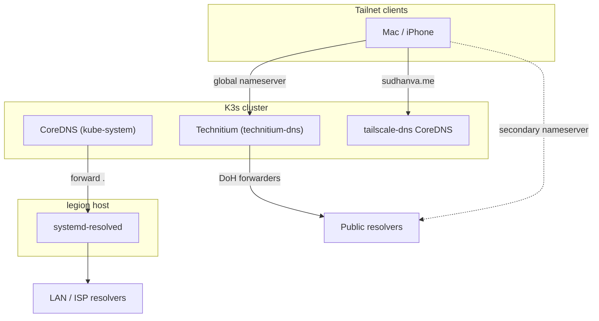

# Node Networking and DNS

This page explains how cluster nodes are addressed, how DNS works at each layer, and how node resources are split between workloads and the control plane.

## Node addressing

Each node joins the tailnet before K3s is provisioned. K3s uses the node's Tailscale IP for both `node-ip` and `node-external-ip`:

| Setting | Value on `legion` | Source |
| --- | --- | --- |
| `node-ip` | `100.66.139.118` | `k3s_node_ip` in `ansible/inventory/hosts.yaml` |
| `node-external-ip` | `100.66.139.118` | `k3s_external_ip` in `ansible/inventory/hosts.yaml` |
| API server endpoint | `https://100.66.139.118:6443` | `ansible_host` |

The Tailscale IP is stable. It does not change when the node switches between Ethernet and Wi-Fi or when the LAN DHCP lease changes. Anything that dials the node's InternalIP depends on this stability, including:

- metrics-server scraping the kubelet
- probes for host-network pods such as node-exporter
- Prometheus node targets

The LAN address is only the node's uplink, so it can come from DHCP.

### Startup ordering

The `k3s_server` role installs a systemd drop-in at `/etc/systemd/system/k3s.service.d/10-tailscale.conf`. It does two things:

- It orders `k3s.service` after `tailscaled.service`.
- It waits until the node's Tailscale IP is assigned to `tailscale0` before K3s starts.

This ensures K3s never starts with a node IP that is not present on the host.

## DNS layers

DNS resolution happens at three independent layers.



### Node layer

Cluster nodes run with Tailscale DNS disabled (`tailscale set --accept-dns=false`). The `tailscale` Ansible role enforces this setting. The host resolves names through the resolvers on its network uplink via `systemd-resolved`.

This keeps node DNS independent of any workload running on the node. The kubelet and containerd need DNS to pull images and to reach the API server, and they keep working even when cluster DNS services are restarting.

### Cluster layer

CoreDNS in `kube-system` is managed from `infrastructure/coredns/configmap.yaml`:

- `cluster.local` names resolve through the Kubernetes plugin.
- `*.sudhanva.me` is rewritten to `gateway-internal.envoy-gateway.svc.cluster.local`, so in-cluster clients reach the Envoy Gateway directly.
- Everything else is forwarded to the node's `/etc/resolv.conf`, which is the node layer above.

### Tailnet layer

Tailnet clients get their DNS configuration from the Tailscale admin console:

| Admin console setting | Value |
| --- | --- |
| Global nameserver | `technitium-dns` Tailscale IP, which provides ad blocking and DNSSEC validation (`apps/technitium/`) |
| Secondary global nameserver | A public resolver such as `1.1.1.1`, used when Technitium is unreachable |
| Split DNS for `sudhanva.me` | `tailscale-dns` Tailscale IP (`infrastructure/tailscale-dns/`) |
| MagicDNS | Enabled |

Technitium and the `sudhanva.me` resolver both run inside the cluster. Tailnet clients get their general internet resolution from Technitium, and the secondary public nameserver keeps that resolution working during cluster maintenance.

## Resource reservations

K3s runs the API server, controller manager, scheduler, datastore, and kubelet in a single `k3s-server` process on the node. The kubelet reserves capacity for it and for the OS through `k3s_kubelet_args` in `ansible/group_vars/all.yaml`:

| Flag | Value |
| --- | --- |
| `kube-reserved` | `cpu=250m,memory=512Mi` |
| `system-reserved` | `cpu=250m,memory=512Mi` |
| `eviction-hard` | `memory.available<500Mi,nodefs.available<10%,imagefs.available<10%` |

Node allocatable is capacity minus these reservations. Pods are confined to allocatable through the `kubepods` cgroup, so memory pressure from workloads leads to pod eviction or OOM kills inside that cgroup. It does not starve `k3s-server`.

Check the resulting allocatable values with:

```bash
kubectl get node legion -o jsonpath='{.status.allocatable}'
```

## Applying changes

Node-level settings are managed only through Ansible. Run a single role with its tag:

```bash
cd ansible
ansible-playbook site.yaml --tags tailscale,k3s --check --diff
ansible-playbook site.yaml --tags tailscale,k3s
```

Changes to `config.yaml` or the systemd drop-in restart K3s through handlers. Running containers keep running across a K3s restart.
