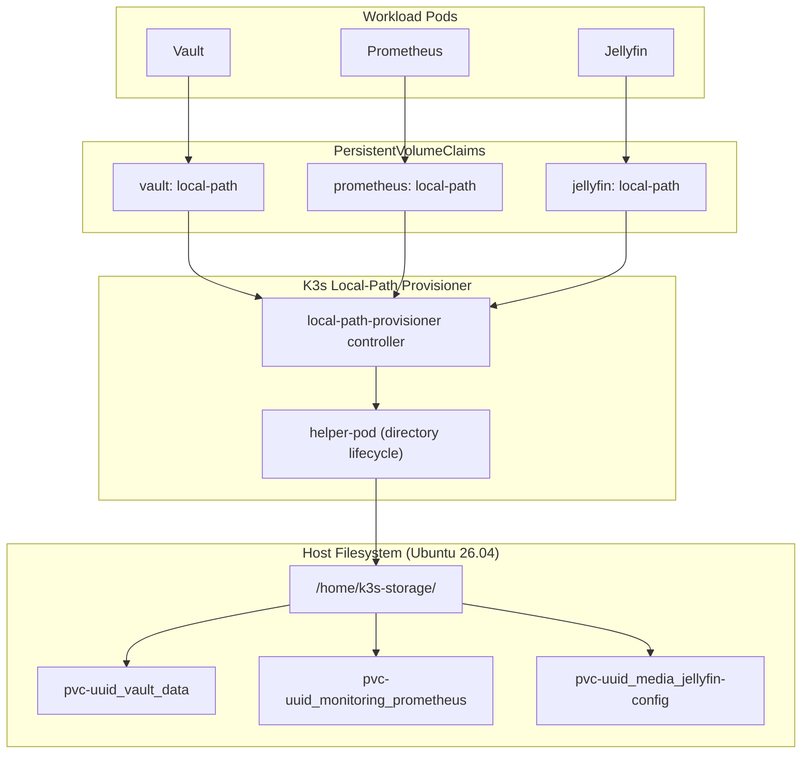

# Local-Path Storage Architecture

This document explains why and how the homelab uses K3s built-in Local-Path Provisioner rather than distributed block storage.

## Architecture Overview

The homelab cluster relies on native host NVMe/SSD partitions mounted at `/home/k3s-storage` for all persistent workloads:



## Why Local-Path Over Distributed Storage

In a compact bare-metal homelab environment, distributed block storage solutions (such as Longhorn or Ceph) introduce significant trade-offs:

- **CPU and Memory Overhead**: Distributed storage engines consume substantial CPU and RAM for replica synchronization, health heartbeats, and storage engine daemons.
- **I/O Latency**: Synchronous network replication amplifies write latency compared to direct NVMe access.
- **Complexity**: Corrupted replica state engines and quorum loss during single-node reboots can stall cluster boot cycles.

Local-path storage bypasses network abstractions entirely by creating hostPath volumes directly on the dedicated SSD partition, maximizing raw I/O throughput and operational simplicity.

## Volume Lifecycle and WaitForFirstConsumer

The default `local-path` StorageClass configures volume binding with `volumeBindingMode: WaitForFirstConsumer`:

- When a PersistentVolumeClaim is applied, it remains in `Pending` state until a consumer pod is scheduled.
- Once a workload Pod referencing the PVC is scheduled to a specific node, the scheduler assigns the node to the PVC.
- The `local-path-provisioner` controller spins up a transient helper pod on that node to create the dedicated directory under `/home/k3s-storage/pvc-<uuid>_<namespace>_<pvc-name>/`.
- The PersistentVolume is bound to the PVC and mounted directly into the container filesystem.

## Host Directory Structure

All persistent volume data is structured deterministically on the node:

```text
/home/k3s-storage/
├── pvc-1a2b3c4d-5e6f_media_jellyfin-config/
├── pvc-9z8y7x6w-5v4u_monitoring_prometheus-data/
└── pvc-3f4e5d6c-7b8a_vault_vault-data/
```

## Backup and Disaster Recovery Strategy

Because data is held directly in standard Linux directories on the host filesystem:

- **Deduplicated Snapshots**: Host-level tooling (such as Restic or Borg) can snapshot `/home/k3s-storage/` without cluster-level storage locks.
- **Node-level Portability**: Backups can be restored to any replacement hardware without complex CSI volume reattachment procedures.
