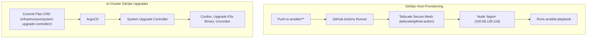

# GitOps-Driven Infrastructure Automation

This repository eliminates manual bash scripts by automating both cluster upgrades and host provisioning directly through Git.



## Host Provisioning via GitHub Actions

Instead of running playbooks manually from your workstation, GitHub Actions executes Ansible whenever changes to `ansible/` land on `master`.

### Step 1: Secure Tailscale Connection

The workflow (`.github/workflows/provision.yaml`) uses `tailscale/github-action` with an ephemeral auth key to join the tailnet and reach `legion` (`100.66.139.118`).

### Step 2: Repository Secrets

Configure two secrets in your GitHub repository (`Settings > Secrets and variables > Actions`):

- `TAILSCALE_AUTHKEY`: An ephemeral or reusable Tailscale auth key with tags `tag:ci` or `tag:k8s`.
- `SSH_PRIVATE_KEY`: An SSH private key authorized to log in as `sudhanva@legion`.

### Step 3: Triggering Provisioning

Provisioning runs automatically on any push modifying `ansible/**` or can be manually triggered via the GitHub Actions **Run workflow** button (`workflow_dispatch`).

## Automated K3s Upgrades via System Upgrade Controller

The cluster runs Rancher's official **System Upgrade Controller** (`infrastructure/system-upgrade-controller/`).

### Step 1: Define Target K3s Version

To upgrade K3s, edit `infrastructure/system-upgrade-controller/k3s-upgrade-plan.yaml` in Git:

```yaml
apiVersion: upgrade.cattle.io/v1
kind: Plan
metadata:
  name: k3s-server
  namespace: system-upgrade
spec:
  concurrency: 1
  version: v1.36.4+k3s1
  nodeSelector:
    matchExpressions:
      - key: node-role.kubernetes.io/control-plane
        operator: Exists
  serviceAccountName: system-upgrade
  cordon: true
  upgrade:
    image: rancher/k3s-upgrade
```

### Step 2: Push to Git

Commit and push your change. ArgoCD syncs the `Plan` resource to the cluster.

### Step 3: Automated Execution

The System Upgrade Controller detects the new version, automatically drains/cordons the node, executes the official `rancher/k3s-upgrade` container to update the binary, restarts the service, and uncordons the node when healthy.
