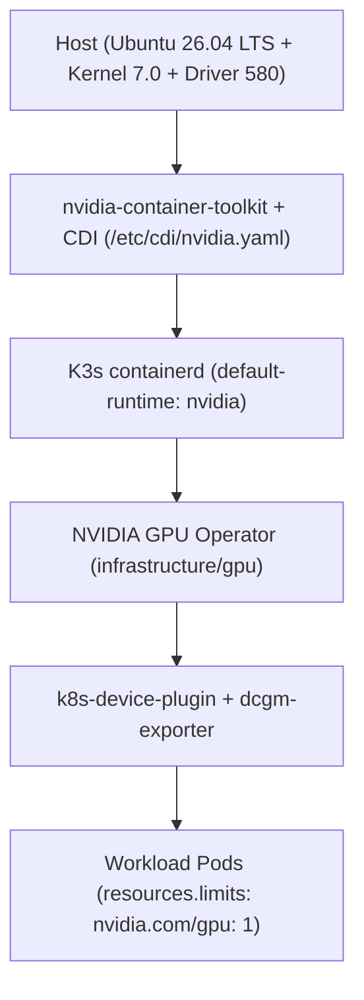

# NVIDIA GPU Acceleration

The homelab node `legion` includes an NVIDIA GeForce GTX 1050 Ti Mobile GPU (Pascal architecture, 4GB VRAM). The GPU is exposed to Kubernetes pods via NVIDIA Container Toolkit, Container Device Interface (CDI), and the NVIDIA GPU Operator.



## Host Configuration

Host dependencies are automated via the Ansible playbook (`ansible/roles/nvidia/`):

- **NVIDIA Driver**: Version 580+ pre-installed on the host.
- **NVIDIA Container Toolkit**: Installed via official apt repository.
- **CDI Generation**: `nvidia-ctk cdi generate --output=/etc/cdi/nvidia.yaml`.
- **Low-level Runtime**: `runc` installed and symlinked to `/usr/bin/runc`.
- **K3s Server**: Configured with `default-runtime: "nvidia"` in `/etc/rancher/k3s/config.yaml`.

## Step 1: GPU Operator Deployment via GitOps

The NVIDIA GPU Operator is declared as an ArgoCD Application in `infrastructure/gpu/gpu-operator.yaml`. It is preconfigured for host-installed drivers:

- `driver.enabled: false` (uses the host's existing 580 series kernel module).
- `toolkit.enabled: false` (leverages the pre-configured host containerd runtime).
- `cdi.enabled: true` (enables Container Device Interface for OCI device injection).
- `validator.plugin.env`: `DISABLE_CUDA_VALIDATION=true` (skips Ampere-specific synthetic checks on Pascal architecture).

## Step 2: Verify GPU Allocation

Confirm that Kubelet registers the GPU on the node:

```bash
kubectl get node legion -o jsonpath='{.status.allocatable.nvidia\.com/gpu}'
```

Expected output:

```text
1
```

Confirm that the GPU model and capabilities are discovered:

```bash
kubectl get node legion -o jsonpath='{.metadata.labels.nvidia\.com/gpu\.product}'
```

Expected output:

```text
NVIDIA-GeForce-GTX-1050-Ti
```

## Step 3: Running a Test Workload

Verify end-to-end container execution by running a quick `nvidia-smi` test pod:

```bash
kubectl run gpu-test --rm -i --restart=Never \
  --image=nvidia/cuda:12.4.1-base-ubuntu22.04 \
  --overrides='{"spec":{"containers":[{"name":"gpu-test","image":"nvidia/cuda:12.4.1-base-ubuntu22.04","command":["nvidia-smi"],"resources":{"limits":{"nvidia.com/gpu":"1"}}}]}}'
```

## Step 4: Requesting GPUs in Workloads

In application manifests (such as Jellyfin or AI inference workloads), request GPU access using standard resource limits:

```yaml
resources:
  limits:
    nvidia.com/gpu: "1"
```
