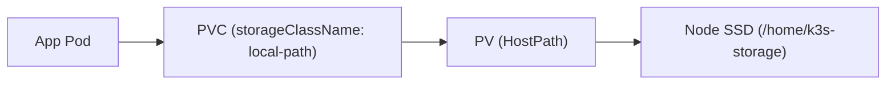

# Persistent Storage (Local-Path Provisioner)

The cluster utilizes K3s's built-in `local-path-provisioner` to dynamically allocate persistent storage directly onto the high-speed NVMe/SSD drive mounted at `/home/k3s-storage`.



## Storage Architecture

The local-path provisioner creates hostPath-backed persistent volumes on demand. Each PVC gets its own dedicated directory on the host under `/home/k3s-storage/` named after the PVC and its UUID:

```bash
/home/k3s-storage/pvc-<uuid>_<namespace>_<pvc-name>/
```

### Storage Configuration in K3s

The storage root path is defined in `/etc/rancher/k3s/config.yaml` during host provisioning via Ansible:

```yaml
default-local-storage-path: "/home/k3s-storage"
```

## Step 1: Verify the StorageClass

The `local-path` StorageClass is set as the default storage class on the cluster:

```bash
kubectl get storageclass
```

Expected output:

```text
NAME                   PROVISIONER             RECLAIMPOLICY   VOLUMEBINDINGMODE      ALLOWVOLUMEEXPANSION   AGE
local-path (default)   rancher.io/local-path   Delete          WaitForFirstConsumer   false                  1h
```

Because the volume binding mode is `WaitForFirstConsumer`, the persistent volume is only allocated once the pod using the claim is scheduled to a node.

## Step 2: Requesting Storage in Applications

To request storage for an application, declare a standard `PersistentVolumeClaim` manifest referencing `local-path`:

```yaml
apiVersion: v1
kind: PersistentVolumeClaim
metadata:
  name: app-data
  namespace: default
spec:
  accessModes:
    - ReadWriteOnce
  storageClassName: local-path
  resources:
    requests:
      storage: 10Gi
```

Attach the volume in the pod specification:

```yaml
spec:
  containers:
    - name: app
      image: alpine:latest
      volumeMounts:
        - name: data
          mountPath: /data
  volumes:
    - name: data
      persistentVolumeClaim:
        claimName: app-data
```

## Step 3: Inspecting Volumes on the Host

To inspect the underlying storage directly on the host machine:

```bash
ssh sudhanva@100.66.139.118 "sudo ls -la /home/k3s-storage"
```

Each persistent volume directory is owned by `root:root` with standard container permissions (`0777` or user-defined UID).

## Step 4: Backup and Disaster Recovery

Because all volumes reside within `/home/k3s-storage`, creating backups is straightforward and non-disruptive:

- **Restic / Borg**: Point your backup client directly to `/home/k3s-storage` to take deduplicated, encrypted snapshots.
- **Rsync**: Mirror the directory to remote network-attached storage or an external drive.
