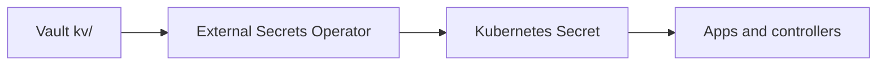
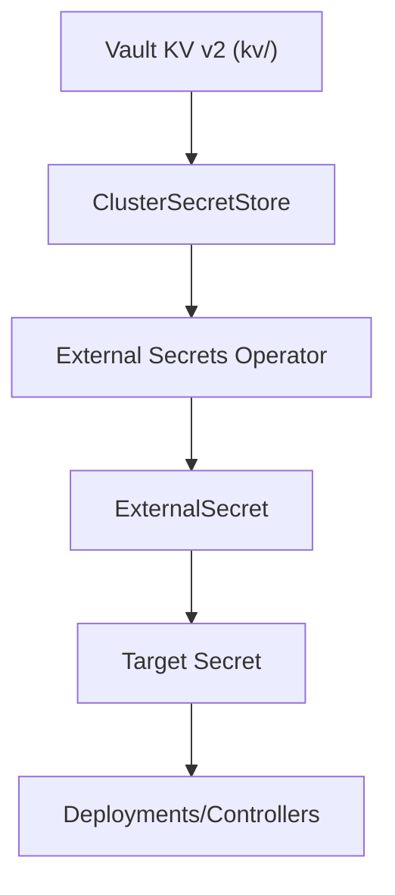

# Vault Secrets

Move cluster secrets into Vault and sync them into Kubernetes with External Secrets Operator.



## Detailed Secret Sync Path



## Step 1: Deploy Vault and External Secrets Operator

Push the repo changes and let ArgoCD sync `infrastructure/vault/` and `infrastructure/external-secrets/`.

Confirm the pods are ready:

```bash
kubectl -n longhorn-system get pods
kubectl -n vault get pods
kubectl -n external-secrets get pods
```

If Vault is Pending, confirm the PVC is bound (Vault depends on Longhorn storage):

```bash
kubectl -n vault get pvc
```

## Step 2: Initialize and unseal Vault

Initialize Vault and save the unseal keys and root token somewhere safe. `vault operator init` prints five unseal keys with a threshold of three. Keep them offline (password manager). If you lose them, the only recovery is wiping the Vault PVC and re-initializing, which destroys stored secrets.

```bash
kubectl -n vault exec -it vault-0 -- vault operator init
```

Unseal Vault with the required number of keys:

```bash
kubectl -n vault exec -it vault-0 -- vault operator unseal
```

Log in with the root token:

```bash
kubectl -n vault exec -it vault-0 -- vault login
```

## Step 3: Enable the KV v2 secrets engine

Enable KV v2 at `kv/` to match the ExternalSecret store config:

```bash
kubectl -n vault exec -it vault-0 -- vault secrets enable -path=kv kv-v2
```

## Step 4: Create secrets in Vault

Write the secrets that Kubernetes currently expects:

```bash
kubectl -n vault exec -it vault-0 -- vault kv put kv/external-dns/cloudflare api-token="REPLACE_ME"
kubectl -n vault exec -it vault-0 -- vault kv put kv/cert-manager/cloudflare api-token="REPLACE_ME"
kubectl -n vault exec -it vault-0 -- vault kv put kv/tailscale/operator-oauth client_id="REPLACE_ME" client_secret="REPLACE_ME"
```

### Step 4a: Filebrowser credentials

Generate a bcrypt hash for the password:

```bash
htpasswd -bnBC 12 filebrowser "REPLACE_ME" | cut -d ':' -f2
```

Store the username, plaintext password, and bcrypt hash:

```bash
kubectl -n vault exec -it vault-0 -- vault kv put kv/filebrowser/auth \
  username="filebrowser" \
  password="REPLACE_ME" \
  password_hash="REPLACE_ME"
```

### Step 4b: Longhorn backup credentials

Store the Backblaze B2 credentials for Longhorn:

```bash
kubectl -n vault exec -it vault-0 -- vault kv put kv/longhorn/b2 \
  access_key_id="REPLACE_ME" \
  application_key="REPLACE_ME" \
  endpoint="REPLACE_ME"
```

## ArgoCD Image Updater credentials

Store registry and Git credentials for ArgoCD Image Updater:

```bash
kubectl -n vault exec -it vault-0 -- vault kv put kv/argocd-image-updater/ghcr \
  username="REPLACE_ME" token="REPLACE_ME"

kubectl -n vault exec -it vault-0 -- vault kv put kv/argocd-image-updater/dockerhub \
  username="REPLACE_ME" token="REPLACE_ME"

kubectl -n vault exec -it vault-0 -- vault kv put kv/argocd/repo-creds \
  username="REPLACE_ME" token="REPLACE_ME"
```

## Step 5: Create a token for External Secrets Operator

Create a minimal policy and a token that can read from `kv/`.

```bash
kubectl -n vault exec -it vault-0 -- /bin/sh -c 'cat > /tmp/external-secrets.hcl <<EOF
path "kv/data/*" {
  capabilities = ["read"]
}
path "kv/metadata/*" {
  capabilities = ["read"]
}
EOF'
kubectl -n vault exec -it vault-0 -- vault policy write external-secrets /tmp/external-secrets.hcl
kubectl -n vault exec -it vault-0 -- vault token create -policy=external-secrets
```

Store the token in Kubernetes:

```bash
kubectl -n external-secrets create secret generic vault-eso-token --from-literal=token="REPLACE_ME"
```

## Step 6: Add new secrets and ExternalSecret resources

When you add a new secret, write it to Vault first, then create an ExternalSecret manifest in the same folder as the consuming workload.

Example Vault write:

```bash
kubectl -n vault exec -it vault-0 -- vault kv put kv/my-app/api token="REPLACE_ME"
```

Example ExternalSecret (save as a standalone YAML file like `apps/my-app/externalsecret.yaml` or `infrastructure/<component>/external-secret.yaml`):

```yaml
apiVersion: external-secrets.io/v1beta1
kind: ExternalSecret
metadata:
  name: my-app-api
  namespace: my-app
spec:
  refreshInterval: 1h
  secretStoreRef:
    name: vault
    kind: ClusterSecretStore
  target:
    name: my-app-api
    creationPolicy: Owner
  data:
  - secretKey: token
    remoteRef:
      key: kv/my-app/api
      property: token
```

Commit the new manifest and let ArgoCD sync it.

## Step 7: Validate ExternalSecret sync

Check that External Secrets Operator created or updated the target secrets:

```bash
kubectl -n external-dns get secret cloudflare-api-token
kubectl -n cert-manager get secret cloudflare-api-token
kubectl -n tailscale get secret operator-oauth
```

Once the secrets match Vault, remove any manually created secrets so External Secrets Operator owns them.

## Step 8: Access the Vault UI

Vault is exposed at `https://vault.sudhanva.me` via the Tailscale Gateway.

## Troubleshooting

### Vault UI blank page

If the Vault UI loads a blank page in the browser while `curl` works, check the Envoy Gateway logs for `response_timeout` entries on `/ui/assets/...`. Large UI bundles can time out through the Gateway.

Update the Vault HTTPRoute to increase the request timeout:

```yaml
apiVersion: gateway.networking.k8s.io/v1
kind: HTTPRoute
metadata:
  name: vault
  namespace: vault
spec:
  rules:
  - timeouts:
      request: 60s
      backendRequest: 60s
```

Commit the change and let ArgoCD sync `infrastructure/gateway/vault-httproute.yaml`.

### ClusterSecretStore not ready

If `infra-external-secrets` is Degraded or ExternalSecrets show `SecretSyncedError`, check the Vault token secret:

```bash
kubectl -n external-secrets get secret vault-eso-token
kubectl -n external-secrets get clustersecretstore vault -o yaml
```

The ClusterSecretStore will not become Ready until `vault-eso-token` exists and contains a valid token.

### ExternalSecrets still failing after Vault recovery

If Vault was re-initialized or secrets were added after External Secrets failed, force a resync.

Step 1: Request a reconcile for all ExternalSecrets.

```bash
kubectl get externalsecrets -A -o jsonpath='{range .items[*]}{.metadata.namespace}{" "}{.metadata.name}{"\n"}{end}' | while read -r ns name; do
  kubectl -n "$ns" annotate externalsecret "$name" reconcile.external-secrets.io/requested-at="$(date -u +%Y-%m-%dT%H:%M:%SZ)" --overwrite
done
```

Step 2: Confirm the sync status.

```bash
kubectl get externalsecrets -A
```
