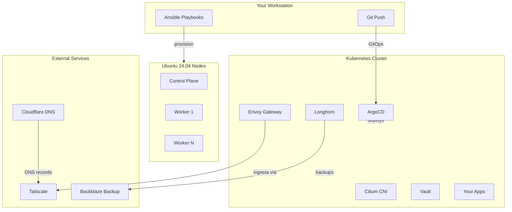

import { Aside, Card, CardGrid, LinkCard, Tabs, TabItem } from '@astrojs/starlight/components';

## What You'll Build

A production-ready Kubernetes cluster with these services accessible via HTTPS on your Tailnet:

| Service | URL | Purpose |
|---------|-----|---------|
| ArgoCD | `argocd.yourdomain.com` | GitOps dashboard |
| Grafana | `grafana.yourdomain.com` | Metrics and dashboards |
| Prometheus | `prometheus.yourdomain.com` | Metrics collection |
| Alertmanager | `alertmanager.yourdomain.com` | Alert routing |
| Vault | `vault.yourdomain.com` | Secrets management |
| Longhorn | `longhorn.yourdomain.com` | Storage dashboard |
| Headlamp | `headlamp.yourdomain.com` | Kubernetes UI |
| Hubble | `hubble.yourdomain.com` | Network observability |
| Home | `home.yourdomain.com` | Dashboard with links |

## Architecture

## Prerequisites

<Tabs>
  <TabItem label="Hardware">
    - **1+ Ubuntu 24.04 nodes** (bare metal or VMs)
    - Minimum 2 CPU, 4GB RAM, 20GB disk per node
    - Nodes can reach each other over the network
    - Optional: GPU for transcoding (Intel iGPU or NVIDIA)
  </TabItem>
  <TabItem label="Accounts">
    - **Tailscale** - Free account at [tailscale.com](https://tailscale.com)
    - **Cloudflare** - Domain with API token for DNS management
    - **Backblaze B2** (optional) - For Longhorn backup storage
    - **GitHub** - For ArgoCD Image Updater write-back
  </TabItem>
  <TabItem label="Workstation">
    - macOS, Linux, or WSL2
    - Ansible, kubectl, Helm, Cilium CLI installed
    - SSH access to all nodes
  </TabItem>
</Tabs>

## Choose Your Path

<CardGrid>
  <LinkCard
    title="Bare Metal Setup"
    href="/how-to/from-scratch/"
    description="Production deployment on real hardware. Full guide from blank nodes to running cluster."
  />
  <LinkCard
    title="Local Development"
    href="/tutorials/local-multipass-cluster/"
    description="Test everything locally with Multipass VMs before touching hardware."
  />
</CardGrid>

## What's Included

<CardGrid stagger>
  <Card title="GitOps with ArgoCD" icon="github">
    Declarative cluster management. Push to Git, ArgoCD deploys.
  </Card>
  <Card title="Ansible Automation" icon="rocket">
    One-command node provisioning. Reproducible and version controlled.
  </Card>
  <Card title="Cilium CNI" icon="seti:graphql">
    eBPF networking with Gateway API via Envoy Gateway.
  </Card>
  <Card title="Tailscale Ingress" icon="setting">
    Secure ingress with split-horizon DNS and automatic certificates.
  </Card>
  <Card title="Vault Secrets" icon="approve-check">
    HashiCorp Vault with External Secrets Operator. No secrets in Git.
  </Card>
  <Card title="Longhorn Storage" icon="document">
    Distributed block storage with S3 backups.
  </Card>
</CardGrid>

## Component Stack

| Layer | Components |
|-------|------------|
| **Bootstrap** | kubeadm, Ansible playbooks |
| **Networking** | Cilium, Envoy Gateway, Tailscale Operator |
| **GitOps** | ArgoCD, ApplicationSets, Image Updater |
| **Secrets** | Vault, External Secrets Operator |
| **Storage** | Longhorn, Backblaze B2 backup |
| **DNS/TLS** | ExternalDNS, cert-manager, Cloudflare |
| **Monitoring** | Prometheus, Grafana, Alertmanager, ntfy |
| **Security** | Kubescape scanning |

## Quick Links

<CardGrid>
  <LinkCard title="Tutorials" href="/tutorials/" description="Step-by-step cluster setup guides" />
  <LinkCard title="How-To Guides" href="/how-to/from-scratch/" description="Task-specific procedures" />
  <LinkCard title="Architecture" href="/explanation/automation-model/" description="GitOps automation model" />
  <LinkCard title="GitHub" href="https://github.com/nsudhanva/homelab" description="Source code" />
</CardGrid>
