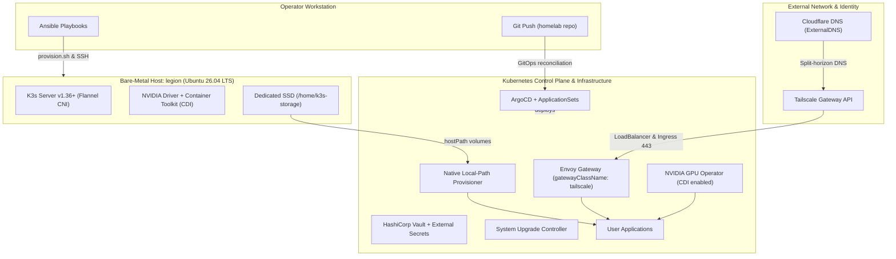

import { Aside, Card, CardGrid, LinkCard, Tabs, TabItem } from '@astrojs/starlight/components';

## What You'll Build

A self-hosted bare-metal Kubernetes cluster on node `legion` with services accessible over Tailscale via Envoy Gateway:

| Service | Hostname | Port | Purpose |
|---------|----------|------|---------|
| ArgoCD | `argocd.sudhanva.me` | 443 | GitOps control plane UI |
| Vault | `vault.sudhanva.me` | 443 | Centralized secret management |
| Grafana | `grafana.sudhanva.me` | 443 | Metrics and dashboards |
| Prometheus | `prometheus.sudhanva.me` | 443 | Metrics collection |
| Alertmanager | `alertmanager.sudhanva.me` | 443 | Alert routing |
| Headlamp | `headlamp.sudhanva.me` | 443 | Kubernetes cluster management UI |
| Home | `home.sudhanva.me` | 443 | Dashboard with service links |
| Jellyfin | `jellyfin.sudhanva.me` | 443 | Media streaming with NVIDIA GTX 1050 Ti transcoding |
| Filebrowser | `filebrowser.sudhanva.me` | 443 | File manager for persistent media volumes |
| Docs | `docs.sudhanva.me` | 443 | Cluster documentation site |

## Architecture

```mermaid
flowchart TB
    subgraph Workstation["Operator Workstation"]
        Ansible["Ansible Playbooks"]
        Git["Git Push (homelab repo)"]
    end

    subgraph Node["Bare-Metal Host: legion (Ubuntu 26.04 LTS)"]
        K3s["K3s Server v1.36+ (Flannel CNI)"]
        GPU["NVIDIA Driver + Container Toolkit (CDI)"]
        Disk["Dedicated SSD (/home/k3s-storage)"]
    end

    subgraph Cluster["Kubernetes Control Plane & Infrastructure"]
        ArgoCD["ArgoCD + ApplicationSets"]
        Envoy["Envoy Gateway (gatewayClassName: tailscale)"]
        Vault["HashiCorp Vault + External Secrets"]
        Storage["Native Local-Path Provisioner"]
        GPUOp["NVIDIA GPU Operator (CDI enabled)"]
        SUC["System Upgrade Controller"]
        Apps["User Applications"]
    end

    subgraph External["External Network & Identity"]
        TS["Tailscale Gateway API"]
        CF["Cloudflare DNS (ExternalDNS)"]
    end

    Ansible -->|provision.sh & SSH| Node
    Git -->|GitOps reconciliation| ArgoCD
    ArgoCD -->|deploys| Cluster
    TS -->|LoadBalancer & Ingress 443| Envoy
    CF -->|Split-horizon DNS| TS
    Disk -->|hostPath volumes| Storage
    Storage --> Apps
    GPUOp --> Apps
    Envoy --> Apps
```

## Prerequisites

<Tabs>
  <TabItem label="Hardware">
    - Bare-metal machine (node `legion`) with Ubuntu 26.04 LTS installed
    - Minimum 4 CPU cores, 16GB RAM
    - Dedicated SSD/NVMe mounted at `/home/k3s-storage`
    - NVIDIA GeForce GTX 1050 Ti GPU for hardware acceleration
    - Stable LAN network connection and static IP
  </TabItem>
  <TabItem label="Accounts">
    - Tailscale account with Tailnet OAuth client configured for the Kubernetes operator
    - Cloudflare account with managed domain (`sudhanva.me`) and API token for ExternalDNS & cert-manager
    - GitHub personal repository with access token for ArgoCD Image Updater
  </TabItem>
  <TabItem label="Workstation">
    - macOS or Linux workstation
    - Ansible, OpenSSH, and `kubectl` installed
    - SSH key access to target node (`sudhanva@legion`) with passwordless sudo
  </TabItem>
</Tabs>

## What's Included

<CardGrid stagger>
  <Card title="GitOps with ArgoCD" icon="github">
    Declarative cluster reconciliation via ApplicationSets. Changes pushed to Git deploy automatically.
  </Card>
  <Card title="Ubuntu 26.04 & K3s v1.36+" icon="rocket">
    Lightweight, production-grade Kubernetes with Flannel CNI and zero-touch Ansible provisioning.
  </Card>
  <Card title="Envoy Gateway & Tailscale" icon="setting">
    Kubernetes Gateway API with Tailscale operator integration, split-horizon DNS, and automated Let's Encrypt TLS.
  </Card>
  <Card title="Vault & External Secrets" icon="approve-check">
    Centralized HashiCorp Vault secrets injected as native Kubernetes secrets via External Secrets Operator.
  </Card>
  <Card title="Local-Path SSD Storage" icon="document">
    Dynamic hostPath storage on dedicated SSD at `/home/k3s-storage` with zero distributed storage overhead.
  </Card>
  <Card title="NVIDIA GPU Acceleration" icon="laptop">
    Hardware acceleration with NVIDIA GPU Operator and Container Device Interface (CDI) for GTX 1050 Ti.
  </Card>
  <Card title="Automated Upgrades" icon="refresh">
    Zero-downtime, declarative K3s upgrades orchestrated by Rancher System Upgrade Controller.
  </Card>
</CardGrid>

## Component Stack

| Layer | Components | Configuration Location |
|-------|------------|------------------------|
| Host & OS | Ubuntu 26.04 LTS (node `legion`) | `ansible/inventory/hosts.yaml` |
| Kubernetes | K3s `v1.36+` (`v1.36.4+k3s1`), Flannel CNI | `ansible/group_vars/all.yaml` |
| Storage | Native Local-Path Provisioner (`/home/k3s-storage`) | `ansible/roles/k3s_server/` |
| Ingress & Networking | Envoy Gateway `v1.9.1`, Tailscale Operator, ExternalDNS, CoreDNS | `infrastructure/gateway/`, `infrastructure/envoy-gateway/` |
| GitOps | ArgoCD `v3.5.2`, ApplicationSets, Image Updater | `bootstrap/`, `infrastructure/argocd-image-updater/` |
| Secrets | HashiCorp Vault `0.34.1`, External Secrets Operator `2.10.0` | `infrastructure/vault/`, `infrastructure/external-secrets/` |
| Hardware / GPU | NVIDIA GPU Operator `v26.7.0` (CDI enabled) | `infrastructure/gpu/` |
| Lifecycle | System Upgrade Controller (Plan `k3s-server`) | `infrastructure/system-upgrade-controller/` |
| Monitoring | kube-prometheus-stack, Grafana, Alertmanager, ntfy | `infrastructure/prometheus/`, `infrastructure/ntfy/` |
| Security | Kubescape Operator | `infrastructure/kubescape/` |

## Quick Links

<CardGrid>
  <LinkCard title="From Scratch" href="/how-to/from-scratch/" description="Complete bare-metal bring-up procedure" />
  <LinkCard title="Gateway & Ingress" href="/explanation/gateway-networking/" description="Envoy Gateway and Tailscale integration" />
  <LinkCard title="Persistent Storage" href="/how-to/storage/" description="Local-Path storage architecture on /home/k3s-storage" />
  <LinkCard title="Version Matrix" href="/reference/versions/" description="Pinned versions for all cluster components" />
</CardGrid>
