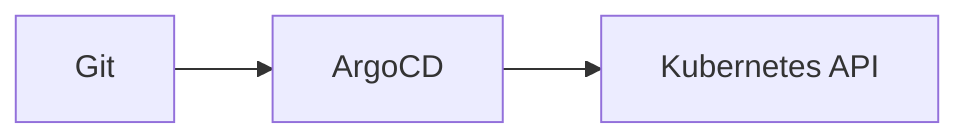

# Docs Structure

Docs are generated from `docs/docs/` using Docusaurus autogenerated sidebars. Navigation order is controlled by `sidebar_position` in each file.

## Naming rules

- Use clear, task-based filenames like `deploy-apps.md` or `argocd-sync.md`
- Keep each doc in the correct Divio section
- Avoid numeric prefixes in filenames

## Frontmatter rules

Each document should include:

- `title` for the sidebar label
- `sidebar_position` for ordering

## Where to place new docs

- Tutorials go in `docs/docs/tutorials/`
- How-to guides go in `docs/docs/how-to/`
- Reference pages go in `docs/docs/reference/`
- Explanations go in `docs/docs/explanation/`

## Docusaurus extensions

Mermaid diagrams are enabled. Use fenced code blocks with the `mermaid` language:



Live code blocks are enabled for MDX. Use `jsx live` to render React snippets:

```jsx live
function Callout() {
  return <div style={{padding: '0.75rem', border: '1px solid #4f89f3'}}>GitOps ready</div>;
}
```
