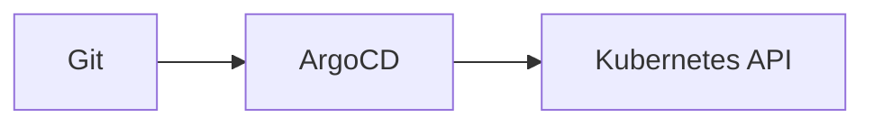

# Documentation Structure

Documentation is built with [Astro Starlight](https://starlight.astro.build/) and follows the [Divio documentation system](https://docs.divio.com/documentation-system/).

## Content Organization

| Section | Purpose | Example |
|---------|---------|---------|
| **Tutorials** | Learning-oriented walkthroughs | Setting up the cluster |
| **How-To Guides** | Problem-oriented procedures | Adding a worker node |
| **Explanation** | Understanding-oriented concepts | GitOps automation model |
| **Reference** | Information-oriented lookup | Version matrix |

## File Locations

```text
docs/src/content/docs/
├── tutorials/      # Step-by-step learning paths
├── how-to/         # Task-specific procedures
├── explanation/    # Architecture and concepts
├── reference/      # Component catalogs and matrices
└── index.mdx       # Landing page
```

## Frontmatter Requirements

Each document must include SEO-optimized frontmatter:

```yaml
---
title: Descriptive Title with Keywords
description: Clear description for search results (150-160 chars)
keywords:
  - primary keyword
  - secondary keyword
  - related terms
sidebar:
  order: 1
---
```

## Naming Conventions

- Use lowercase kebab-case: `add-worker-node.md`
- Use task-based names: `deploy-apps.md` not `apps.md`
- Avoid numeric prefixes in filenames

## Mermaid Diagrams

Diagrams are rendered with the astro-mermaid plugin:



## Writing Guidelines

- Follow [AGENTS.md](/AGENTS.md) conventions
- Use tables instead of numbered lists for steps
- Avoid inline YAML comments
- Keep prose professional without marketing language
