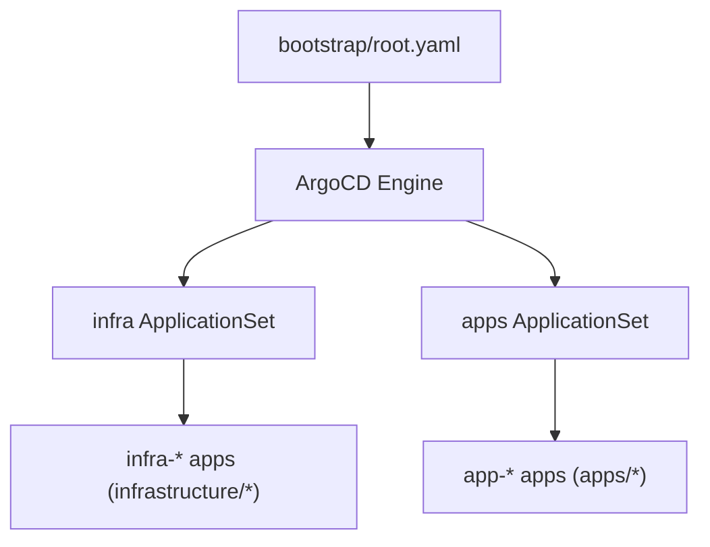

# ArgoCD and GitOps

ArgoCD is the primary declarative engine for the cluster. It continuously synchronizes Kubernetes resources against the master branch of this repository.

## Step 1: Automated vs Manual Installation

When running `./scripts/provision.sh`, the Ansible role `ansible/roles/argocd` installs ArgoCD and applies the root application automatically.

If you ever need to manually deploy or recover ArgoCD:

```bash
kubectl apply --server-side --force-conflicts -k bootstrap/argocd
kubectl wait --for=condition=available --timeout=600s deployment/argocd-server -n argocd
```

Retrieve the initial admin password:

```bash
kubectl -n argocd get secret argocd-initial-admin-secret -o jsonpath='{.data.password}' | base64 -d; echo
```

:::note

ArgoCD is exposed via Gateway API at `argocd.sudhanva.me`.

The deployment includes `argocd-cmd-params-patch.yaml` setting `server.insecure: "true"` because TLS terminates at Envoy Gateway.

:::

## Step 2: The ApplicationSet pattern

The repository uses two ApplicationSets in `bootstrap/templates/`:



- **`bootstrap/templates/infra-appset.yaml`**: Discovers every subdirectory in `infrastructure/` and deploys its manifests or Helm charts into the cluster.
- **`bootstrap/templates/apps-appset.yaml`**: Discovers workloads via `apps/*/app.yaml` and deploys applications into target namespaces with auto-prune and self-healing.

## Step 3: Apply the root bootstrap application

To trigger reconciliation of all infrastructure components and applications:

```bash
kubectl apply -f bootstrap/root.yaml
```

ArgoCD reconciles `root.yaml`, which creates the ApplicationSets, which in turn generate and synchronize all applications across the cluster.

## Step 4: Verify application sync status

Check that all applications report `Synced` and `Healthy`:

```bash
kubectl get applications -n argocd
```

To add a new workload or infrastructure component, push your manifests directly to Git; ArgoCD deploys them automatically.
