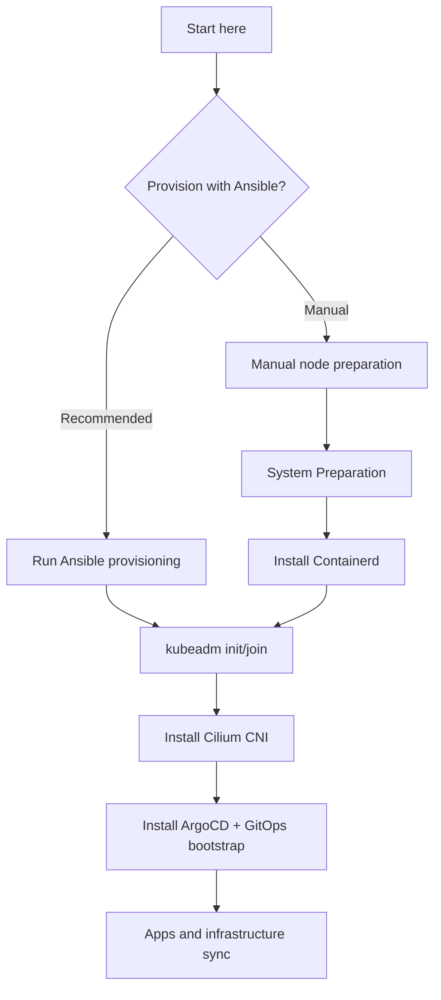

# Cluster Setup Tutorials

These tutorials walk you through building a production-ready Kubernetes cluster from scratch. Choose your path based on whether you want automated provisioning or prefer manual control.

:::note

Ansible provisioning handles system prep, containerd, and Kubernetes packages. It does not run `kubeadm init/join` or install Cilium/ArgoCD.

:::

## Ansible Path (Recommended)

Use this path for reproducible, version-controlled node provisioning.

| Step | Tutorial | What You Get |
|------|----------|--------------|
| 1 | [Prerequisites](./prerequisites.md) | Workstation tools, Ansible inventory, SSH access |
| 2 | [Kubernetes](./kubernetes.md) | Control plane initialized with kubeadm |
| 3 | [Cilium CNI](./cilium.md) | eBPF networking, kube-proxy replacement |
| 4 | [ArgoCD and GitOps](./argocd.md) | GitOps continuous deployment |
| 5 | [Join Worker Nodes](./join-workers.md) | Multi-node cluster |

## Manual Path (Advanced)

Use this path when you need full control over each configuration step.

| Step | Tutorial | What You Get |
|------|----------|--------------|
| 1 | [Prerequisites](./prerequisites.md) | Workstation tools, inventory |
| 2 | [System Preparation](./system-prep.md) | Swap disabled, kernel modules, sysctl |
| 3 | [Install Containerd](./containerd.md) | Container runtime configured |
| 4 | [Kubernetes](./kubernetes.md) | Control plane initialized |
| 5 | [Cilium CNI](./cilium.md) | CNI and kube-proxy replacement |
| 6 | [ArgoCD and GitOps](./argocd.md) | GitOps deployment |
| 7 | [Join Worker Nodes](./join-workers.md) | Multi-node cluster |

## Local Development

Want to test the setup before touching hardware? Use the [Local Multipass Cluster](./local-multipass-cluster.md) tutorial to spin up VMs on your workstation.
