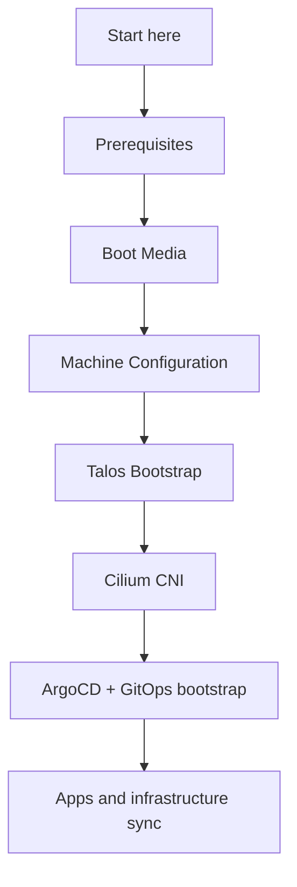

# Cluster Setup Tutorials

These tutorials walk you through building a production-ready Kubernetes cluster from scratch. The scripted path below is the recommended flow. Every step is also documented individually for manual control.

```mermaid
flowchart TD
  Start["Start here"] --> Prereq["Prerequisites"]
  Prereq --> Media["Boot Media"]
  Media --> MachineConfig["Machine Configuration"]
  MachineConfig --> Bootstrap["Talos Bootstrap"]
  Bootstrap --> Cilium["Cilium CNI"]
  Cilium --> Argo["ArgoCD + GitOps bootstrap"]
  Argo --> Sync["Apps and infrastructure sync"]
```

## Scripted Path (Recommended)

Use this path for reproducible, version-controlled cluster builds.

| Step | Tutorial | What You Get |
|------|----------|--------------|
| 1 | [Prerequisites](./prerequisites.md) | Workstation tools, machine inventory |
| 2 | [Boot Media](./system-prep.md) | Installer image on USB |
| 3 | [Machine Configuration](./containerd.md) | Rendered Talos configs |
| 4 | [Talos Bootstrap](./kubernetes.md) | Running Kubernetes cluster |
| 5 | [Cilium CNI](./cilium.md) | eBPF networking, kube-proxy replacement |
| 6 | [ArgoCD and GitOps](./argocd.md) | GitOps continuous deployment |
| 7 | [Add Workers](./join-workers.md) | Multi-node cluster |

## Local Development

Want to test the setup before touching hardware? Use the [Local Talos Cluster](./local-talos-cluster.md) tutorial to rehearse with QEMU virtual machines on your workstation.
