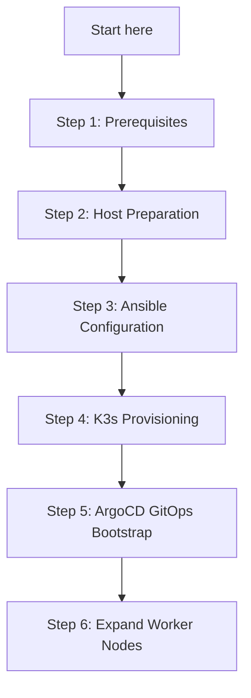

# Cluster Setup Tutorials

These tutorials guide you step-by-step through setting up a bare-metal K3s Kubernetes cluster on node `legion` (Ubuntu 26.04 LTS) from scratch.

```mermaid
flowchart TD
  Start["Start here"] --> Prereq["Step 1: Prerequisites"]
  Prereq --> Prep["Step 2: Host Preparation"]
  Prep --> Config["Step 3: Ansible Configuration"]
  Config --> Provision["Step 4: K3s Provisioning"]
  Provision --> Argo["Step 5: ArgoCD GitOps Bootstrap"]
  Argo --> Workers["Step 6: Expand Worker Nodes"]
```

## Tutorial Roadmap

Follow these tutorials in sequence to build a reproducible, production-ready homelab cluster:

| Stage | Tutorial | Deliverable |
|---|---|---|
| Step 1 | [Prerequisites](./prerequisites.md) | Workstation dependencies and access credentials |
| Step 2 | [Host Preparation](./system-prep.md) | Ubuntu 26.04 installation, networking, and storage mount |
| Step 3 | [Ansible Configuration](./containerd.md) | Inventory variables and host role definitions |
| Step 4 | [K3s Bootstrap](./kubernetes.md) | Live K3s cluster with Flannel CNI and NVIDIA CDI |
| Step 5 | [ArgoCD and GitOps](./argocd.md) | Declarative infrastructure and app synchronization |
| Step 6 | [Add Workers](./join-workers.md) | Multi-node scaling with K3s agent nodes |
